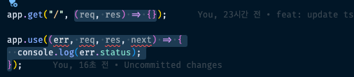
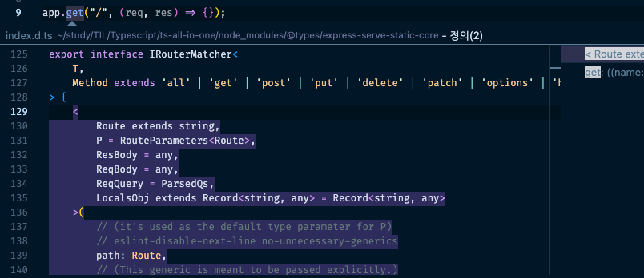

## Node, Express 타입

### @types/node

Node 서버 코드에 대한 타이핑을 추가적으로 배워본다. node의 경우 node 모듈들에 대한 타이핑을 하는 개념
먼저 node 모듈들에 대한 타입을 설치해야 한다.

```bash
> npm i -D @types/node
```

`node.ts`

```tsx
import fs = require("fs");
import http = require("http");
import path = require("path");

http
  .createServer((req, res) => {
    // brower는 number로 리턴, node는 NodeJS.Timeout 리턴
    const id = setTimeout(() => {
      console.log("hello");
    }, 1000);
    // ..
  })
  .listen(8080, () => {
    console.log("server started");
  });
```

위와 같은 구조에서 node 파일의 경우 setTimeout이 `NodeJS.Timeout`으로 반환 값이 추론된다.
즉 브라우저에서의 setTimeout과 노드 안에서의 setTimeout은 조금 다른 개념..

다음으로 path모듈을 타입으로 찾아가보면 아래와 같은 구조로 되어있다.

`@types/node/path.d.ts`

```tsx
declare module "path" {
  namespace path {
    // ..
  }
}
```

위와 같이 타입 선언만 있고 구현이 없는 것을 앰비언트라고 한다. 즉, `declare module …` 이걸 앰비언트(ambient) 모듈이라고 할 수 있다. 모듈 타이핑을 해주는 방식으로 이해. 이 구조는 fs도 마찬가지이다.

`@types/node/fs.d.ts`

```tsx
declare module "fs" {
  import * as stream from "node:events";
  // ..
}
// ..
declare module "node:fs" {
  export * from "fs";
}
```

해당 방식은 `@types/node`에서 node에 대한 모듈을 모두 구현하므로, 이런 모듈 단위의 타이핑이 들어간 것이라고 이해하면 된다.

또한 마지막에 node:fs라는 모듈정의가 fs를 모두 포함하도록 처리되고 있는데, 이는 즉 node 모듈 import 시 아래와 같은 방식을 지원함을 의미한다.

```tsx
import fs = require("node:fs");
import http = require("node:http");
import path = require("node:path");
```

실제 node에서는 위 방식을 더 추천함.
위와 같이 처리 후 이제 http, fs, path 모듈 타입 분석을 하나씩 해나가면 된다.
우선 서버 시작을 위해 위와 같이 코드 작성 후 `npx ts-node node.ts` 로 아래 파일을 실행시켜 준다.

`node.ts`

```tsx
import fs from "fs";
import http from "http";
import path from "path";

http
  .createServer((req, res) => {
    fs.readFile(path.join(__dirname, "index.html"), (err, data) => {
      res.writeHead(200);
      res.end(data);
    });
  })
  .listen(8080, () => {
    console.log("server started");
  });
```

`index.html`

```tsx
<html>
	<head>
	  <meta charset="UTF-8">
	  <title>Vicky TS 연습</title>
	</head>

	<body>
	  <div>TS 연습해봅시다.</div>
	</body>
</html>
```

위에서 `http.createServer`, `fs.readFile`. `path.join` 등에 대한 메서드의 타입을 모두 확인할 수 있으며, 필요에 따라 내부에 어떤 타입이 적용되는지 확인해보면 좋겠다.

### @types/express

node는 위처럼 하나씩 메서드를 열어보면서 타입을 확인해보면 된다. 중점적으로 볼 것은 express이다.

```bash
> npm i express
> npm i -D @types/express
```

`express.ts`

```tsx
import express from "express";

const app = express();

app.use(express.json());
app.use(express.urlencoded({ extended: false }));
app.use("/", express.static("./public"));

app.get("/", (req, res) => {});

app.listen(8080, () => {});
```

위 구조의 express 기본 코드에서 express는 함수인데 타입스크립트? 라고 생각하면 안됨.
아마도 구조는 아래와 같은 꼴일 것이다.

```tsx
// 예시용. 샘플 코드
interface ExpressFunction {
	(): App;
}

interface Express extends ExpressFunction {
	json: () => Middleware;
	urlEncoded: ({ extended?: boolean }) => Middleware;
	static: (path: string) => Middleware;
}
```

실제 `express/index.d.ts`는 아래와 같다.

```tsx
import * as bodyParser from "body-parser";
import * as serveStatic from "serve-static";
import * as core from "express-serve-static-core"; // 핵심 로직이 몰려있다.
import * as qs from "qs";

declare function e(): core.Express;

// ..
export = e;
```

위 export 구조를 통해 모듈 형태로 타입이 정의되었다는 것을 알 수 있음 (import e from “express”; 도 가능)

### express middlware 타이핑

위 index.d.ts에서 본 것처럼 핵심로직이 별도 타입 모듈로 분리되어 있음.
express-serve-static-core를 이루는 index.d.ts 파일을 보면 아래와 같음

```tsx
declare global {
  namespace Express {
    // These open interfaces may be extended in an application-specific manner via declaration merging.
    // See for example method-override.d.ts (https://github.com/DefinitelyTyped/DefinitelyTyped/blob/master/types/method-override/index.d.ts)
    interface Request {}
    interface Response {}
    interface Locals {}
    interface Application {}
  }
}
```

위와 같이 해당 모듈이 global로 선언된 것을 확인할 수 있는데, 이는 express를 사용하는 모든 곳에서 활용이 가능하다는 의미가 된다. 또한, `declare global`, `declare namespace ~`, `declare module ~` 이런 아이들은 타입이 합쳐지는 특성이 있다. 합쳐진다는 것은 큰 장점을 지니는데, 나중에 수정이나 확장이 가능한 것을 의미한다. (즉, global로 선언했다는 것은 사용자가 직접 수정할 수 있도록 열어둔 개념이라고 보면 된다.)

즉 아래와 같은 구조가 가능해진다.

```tsx
import express, { Request, Response, NextFunction } from "express";

// interface 합치기 위해 global - Express 내부로 선언
// 이를 인터페이스 확장이라고 한다.
declare global {
  namespace Express {
    interface Response {
      vicky: string;
    }
  }
}

const middleware = (req: Request, res: Response, next: NextFunction) => {
  res.vicky; // string
};
```

express는 사실 미들웨어가 전부임



우리는 미들웨어와 이러한 미들웨어를 장착할 수 있는 use, get, post, all 등의 메서드를 훑어봐야 한다.
먼저 get 메서드에 대해 타입 정의를 살펴보면 아래와 같다.

```tsx
export interface IRouterMatcher<
  T,
  Method extends "all" | "get" | "post" | "put" | "delete" | "patch" | "options" | "head" = any
> {
  <
    Route extends string,
    P = RouteParameters<Route>,
    ResBody = any,
    ReqBody = any,
    ReqQuery = ParsedQs,
    LocalsObj extends Record<string, any> = Record<string, any>
  >(
    // (it's used as the default type parameter for P)
    // eslint-disable-next-line no-unnecessary-generics
    path: Route,
    // (This generic is meant to be passed explicitly.)
    // eslint-disable-next-line no-unnecessary-generics
    ...handlers: Array<RequestHandler<P, ResBody, ReqBody, ReqQuery, LocalsObj>>
  ): T;
  <
    Path extends string,
    P = RouteParameters<Path>,
    ResBody = any,
    ReqBody = any,
    ReqQuery = ParsedQs,
    LocalsObj extends Record<string, any> = Record<string, any>
  >(
    // (it's used as the default type parameter for P)
    // eslint-disable-next-line no-unnecessary-generics
    path: Path,
    // (This generic is meant to be passed explicitly.)
    // eslint-disable-next-line no-unnecessary-generics
    ...handlers: Array<RequestHandlerParams<P, ResBody, ReqBody, ReqQuery, LocalsObj>>
  ): T;
  <
    P = ParamsDictionary,
    ResBody = any,
    ReqBody = any,
    ReqQuery = ParsedQs,
    LocalsObj extends Record<string, any> = Record<string, any>
  >(
    path: PathParams,
    // (This generic is meant to be passed explicitly.)
    // eslint-disable-next-line no-unnecessary-generics
    ...handlers: Array<RequestHandler<P, ResBody, ReqBody, ReqQuery, LocalsObj>>
  ): T;
  <
    P = ParamsDictionary,
    ResBody = any,
    ReqBody = any,
    ReqQuery = ParsedQs,
    LocalsObj extends Record<string, any> = Record<string, any>
  >(
    path: PathParams,
    // (This generic is meant to be passed explicitly.)
    // eslint-disable-next-line no-unnecessary-generics
    ...handlers: Array<RequestHandlerParams<P, ResBody, ReqBody, ReqQuery, LocalsObj>>
  ): T;
  (path: PathParams, subApplication: Application): T;
}
```

갱장히 어렵다 🥲 그런데 위 문법에 공통점이 있다. 방식이 조금씩 다른 같은 형태의 값들.. 즉 오버로딩 형태의 타이핑 구조라는 것을 알 수 있음. 이를 사용하는 쪽은 어디인지 좀 더 타고들어가보면 아래와 같음

```tsx
export interface IRouter extends RequestHandler {
  param(name: string, handler: RequestParamHandler): this;
  param(callback: (name: string, matcher: RegExp) => RequestParamHandler): this;

  /**
   * Special-cased "all" method, applying the given route `path`,
   * middleware, and callback to _every_ HTTP method.
   */
  all: IRouterMatcher<this, "all">;
  get: IRouterMatcher<this, "get">;
  post: IRouterMatcher<this, "post">;
  put: IRouterMatcher<this, "put">;
  delete: IRouterMatcher<this, "delete">;
  patch: IRouterMatcher<this, "patch">;
  options: IRouterMatcher<this, "options">;
  head: IRouterMatcher<this, "head">;

  checkout: IRouterMatcher<this>;
  connect: IRouterMatcher<this>;
  copy: IRouterMatcher<this>;
  lock: IRouterMatcher<this>;
  merge: IRouterMatcher<this>;
  mkactivity: IRouterMatcher<this>;
  mkcol: IRouterMatcher<this>;
  move: IRouterMatcher<this>;
  "m-search": IRouterMatcher<this>;
  notify: IRouterMatcher<this>;
  propfind: IRouterMatcher<this>;
  proppatch: IRouterMatcher<this>;
  purge: IRouterMatcher<this>;
  report: IRouterMatcher<this>;
  search: IRouterMatcher<this>;
  subscribe: IRouterMatcher<this>;
  trace: IRouterMatcher<this>;
  unlock: IRouterMatcher<this>;
  unsubscribe: IRouterMatcher<this>;

  use: IRouterHandler<this> & IRouterMatcher<this>;

  route<T extends string>(prefix: T): IRoute<T>;
  route(prefix: PathParams): IRoute;
  stack: any[];
}
```

즉 IRouter에서 각 메서드들에게 부여하는 값이라는 것을 알 수 있음

```tsx
export interface IRouterMatcher<
    T,
    Method extends 'all' | 'get' | 'post' | 'put' | 'delete' | 'patch' | 'options' | 'head' = any
>
```

IRouterMatcher는 위와 같이 시작하므로 T는 this가 되고, 다음 메서드들은 all, get, post 값 등을 가지게 된다.
그리고 실제 사용한 값에서 정의로 이동했을 때 실제 사용되는 값으로 아래와 같이 매칭이 되기 때문에 처음부터 겁먹을 필요는 없다.



```tsx
export interface IRouterMatcher<
  T,
  Method extends "all" | "get" | "post" | "put" | "delete" | "patch" | "options" | "head" = any
> {
  <
    Route extends string,
    P = RouteParameters<Route>,
    ResBody = any,
    ReqBody = any,
    ReqQuery = ParsedQs,
    LocalsObj extends Record<string, any> = Record<string, any>
  >(
    // (it's used as the default type parameter for P)
    // eslint-disable-next-line no-unnecessary-generics
    path: Route,
    // (This generic is meant to be passed explicitly.)
    // eslint-disable-next-line no-unnecessary-generics
    ...handlers: Array<RequestHandler<P, ResBody, ReqBody, ReqQuery, LocalsObj>>
  ): T;
}
```

위 구조가 매칭되는 타이핑이라면 path는 Route 타입이고, Route는 string 타입이라고 명시되어 있으므로 `app.get("/", (req, res) => {});` 에서 `/` 를 의미하는 것임을 알 수 있다.

다음으로 handlers에 전개연산자가 붙어있는데 보통 저런 형태의 경우 배열을 의미하며, 이는 RequestHandler 타입이며 이러한 값이 여러 개 될 수 있음을 시사해준다. 즉 아래와 같은 코드 작성이 가능한 것임

```tsx
// 미들웨어는 RequestHandler이다.
app.get(
  "/",
  cors(),
  multer(),
  (req, res, next) => {
    // ..
  },
  (req, res, next) => {
    // ..
  },
  (req, res, next) => {
    // ..
  },
  (req, res, next) => {
    // ..
  }
);
```

실제 코드를 작성하다보면 저 미들웨어 내부의 인자를 타입스크립트에서 대부분 추론해 줌
이는 `RequestHandler<P, ResBody, ReqBody, ReqQuery, LocalsObj>` 이러한 정보를 모두 타입으로 가지고 있기 때문이다.

문제는 저 미들웨어를 별도로 바깥으로 분리했을 때 타입스크립트가 express middleware임을 잘 알지 못한다.

```tsx
const middleware = (req: Express.Request, res: Express.Response, next: express.NextFunction) => {};

// 혹은
import express, { Request, Response, NextFunction } from "express";
const middleware = (req: Request, res: Response, next: NextFunction) => {};

// 혹은
const middleware: RequestHandler = (req, res, next) => {};
```

그 때는 위처럼 직접 인자에 타입을 지정해주는 방법으로 해결할 수 있음

### req, res 속성 타이핑

해당 middleware에서 req, res 인자를 사용해 아래와 같은 데이터들을 가져다 쓸 수 있다.

```tsx
const middleware: RequestHandler = (req, res, next) => {
  req.body.bodyType; // any
  req.params.paramType; // ParamsDictionary[string]: string
  req.query.queryType; // string | QueryString.ParsedQs | string[] | QueryString.ParsedQs[] | undefined
  res.locals.localType; // any
};
```

그런데 위와 같이 타입이 정확하지 않게 any로 추론되는 것들이 많음.
RequestHandler 타입을 보면 아래와 같이 제네릭을 사용해 다양한 타이핑이 가능하도록 되어있다.

```tsx
interface RequestHandler<
  P = core.ParamsDictionary,
  ResBody = any,
  ReqBody = any,
  ReqQuery = core.Query,
  Locals extends Record<string, any> = Record<string, any>
> extends core.RequestHandler<P, ResBody, ReqBody, ReqQuery, Locals> {}
```

따라서 위 방법을 그대로 차용해 사용하는 메서드에 대한 상세한 타입을 정의해주는 것이 바람직함

```tsx
const middleware: RequestHandler<
  { paramType: string },
  { message: string },
  { bodyType: number },
  { queryType: boolean },
  { localType: unknown }
> = (req, res, next) => {
  req.params.paramType; // string
  req.body.bodyType; // number
  req.query.queryType; // boolean
  res.locals.localType; // unknown
  res.json({
    message: "hello", // string
  });
};
```

위와 같이 제네릭에 각 위치별로 정확한 타이핑을 추가해주면 하위 실제 코드에서 원하는 대로 타입이 추론되는 것을 확인할 수 있다.
