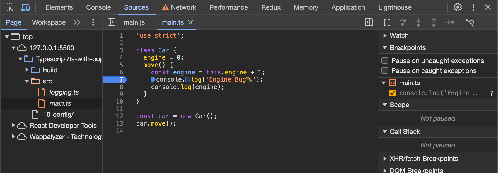

### TSConfig 셋업 - 다수의 파일 실시간 컴파일

기존에 ts 파일을 자동으로 js로 변환하기 위해 아래의 메서드를 실행시켰다.

```bash
> npx tsc logging.ts -w
```

위와 같이 하면 `logging.ts` 파일이 `logging.js` 변환되고, 파일이 수정될 때마다 지속적으로 업데이트 됨

만약 다수의 파일이라면 어떻게하면 되는가? 바로 프로젝트 내에 `tsconfig.json`을 두면됨

```bash
> tsc --init
```

위 명령어로 `tsconfig.json` 파일을 생성해준다. 아래 내용이 자동완성으로 들어있음

```json
{
  "compilerOptions": {
    /* Visit https://aka.ms/tsconfig.json to read more about this file */

    /* Basic Options */
    // "incremental": true,                   /* Enable incremental compilation */
    "target": "es5" /* Specify ECMAScript target version: 'ES3' (default), 'ES5', 'ES2015', 'ES2016', 'ES2017', 'ES2018', 'ES2019', 'ES2020', or 'ESNEXT'. */,
    "module": "commonjs" /* Specify module code generation: 'none', 'commonjs', 'amd', 'system', 'umd', 'es2015', 'es2020', or 'ESNext'. */,
    // "lib": [],                             /* Specify library files to be included in the compilation. */
    // "allowJs": true,                       /* Allow javascript files to be compiled. */
    // "checkJs": true,                       /* Report errors in .js files. */
    // "jsx": "preserve",                     /* Specify JSX code generation: 'preserve', 'react-native', or 'react'. */
    // "declaration": true,                   /* Generates corresponding '.d.ts' file. */
    // "declarationMap": true,                /* Generates a sourcemap for each corresponding '.d.ts' file. */
    // "sourceMap": true,                     /* Generates corresponding '.map' file. */
    // "outFile": "./",                       /* Concatenate and emit output to single file. */
    // "outDir": "./",                        /* Redirect output structure to the directory. */
    // "rootDir": "./",                       /* Specify the root directory of input files. Use to control the output directory structure with --outDir. */
    // "composite": true,                     /* Enable project compilation */
    // "tsBuildInfoFile": "./",               /* Specify file to store incremental compilation information */
    // "removeComments": true,                /* Do not emit comments to output. */
    // "noEmit": true,                        /* Do not emit outputs. */
    // "importHelpers": true,                 /* Import emit helpers from 'tslib'. */
    // "downlevelIteration": true,            /* Provide full support for iterables in 'for-of', spread, and destructuring when targeting 'ES5' or 'ES3'. */
    // "isolatedModules": true,               /* Transpile each file as a separate module (similar to 'ts.transpileModule'). */

    /* Strict Type-Checking Options */
    "strict": true /* Enable all strict type-checking options. */,
    // "noImplicitAny": true,                 /* Raise error on expressions and declarations with an implied 'any' type. */
    // "strictNullChecks": true,              /* Enable strict null checks. */
    // "strictFunctionTypes": true,           /* Enable strict checking of function types. */
    // "strictBindCallApply": true,           /* Enable strict 'bind', 'call', and 'apply' methods on functions. */
    // "strictPropertyInitialization": true,  /* Enable strict checking of property initialization in classes. */
    // "noImplicitThis": true,                /* Raise error on 'this' expressions with an implied 'any' type. */
    // "alwaysStrict": true,                  /* Parse in strict mode and emit "use strict" for each source file. */

    /* Additional Checks */
    // "noUnusedLocals": true,                /* Report errors on unused locals. */
    // "noUnusedParameters": true,            /* Report errors on unused parameters. */
    // "noImplicitReturns": true,             /* Report error when not all code paths in function return a value. */
    // "noFallthroughCasesInSwitch": true,    /* Report errors for fallthrough cases in switch statement. */
    // "noUncheckedIndexedAccess": true,      /* Include 'undefined' in index signature results */

    /* Module Resolution Options */
    // "moduleResolution": "node",            /* Specify module resolution strategy: 'node' (Node.js) or 'classic' (TypeScript pre-1.6). */
    // "baseUrl": "./",                       /* Base directory to resolve non-absolute module names. */
    // "paths": {},                           /* A series of entries which re-map imports to lookup locations relative to the 'baseUrl'. */
    // "rootDirs": [],                        /* List of root folders whose combined content represents the structure of the project at runtime. */
    // "typeRoots": [],                       /* List of folders to include type definitions from. */
    // "types": [],                           /* Type declaration files to be included in compilation. */
    // "allowSyntheticDefaultImports": true,  /* Allow default imports from modules with no default export. This does not affect code emit, just typechecking. */
    "esModuleInterop": true /* Enables emit interoperability between CommonJS and ES Modules via creation of namespace objects for all imports. Implies 'allowSyntheticDefaultImports'. */,
    // "preserveSymlinks": true,              /* Do not resolve the real path of symlinks. */
    // "allowUmdGlobalAccess": true,          /* Allow accessing UMD globals from modules. */

    /* Source Map Options */
    // "sourceRoot": "",                      /* Specify the location where debugger should locate TypeScript files instead of source locations. */
    // "mapRoot": "",                         /* Specify the location where debugger should locate map files instead of generated locations. */
    // "inlineSourceMap": true,               /* Emit a single file with source maps instead of having a separate file. */
    // "inlineSources": true,                 /* Emit the source alongside the sourcemaps within a single file; requires '--inlineSourceMap' or '--sourceMap' to be set. */

    /* Experimental Options */
    // "experimentalDecorators": true,        /* Enables experimental support for ES7 decorators. */
    // "emitDecoratorMetadata": true,         /* Enables experimental support for emitting type metadata for decorators. */

    /* Advanced Options */
    "skipLibCheck": true /* Skip type checking of declaration files. */,
    "forceConsistentCasingInFileNames": true /* Disallow inconsistently-cased references to the same file. */
  }
}
```

이후 터미널에서 아래와 같은 명령어를 실행

```bash
> tsc -w

Starting compilation in watch mode...
Found 0 errors. Watching for file changes.
```

위와 같이 하면 변경되는 파일이 모두 `tsconfig.json`에 의해 watch mode가 실행되고, 변경 시마다 ts → js 업데이트

### 프로젝트 구조 정리

프로젝트 구조화에 대해 알아본다.

현재는 tsconfig.json을 통해 생성되는 js. ts 파일이 한 루트에서 섞이므로 이 구조를 정리해본다.

`tsconfig.json`

```json
{
  // ..
  "outDir": "./build" /* Redirect output structure to the directory. */
  // ..
}
```

위처럼 설정 후 `tsc -w`를 재실행하면 ./build 구조 아래애 js이 컴파일 되는 것을 확인할 수 있음.

만약 아래와 같이 ts 파일이 ./src 하위에 존재하게 된다면 js 컴파일 파일도 ./build/src/\*로 생성될까?

```bash
.
├── build
│   ├── logging.ts
│   └── main.js
├── src
│   ├── logging.ts
│   └── main.ts
├── index.html
└── tsconfig.json
```

아님. 첫 시작이 되는 타입스크립트 파일이 ./src/\*부터 존재하므로 가장 최상위인 곳부터 컴파일 생성.

동일하게 ./build/\* 하위에 파일이 생성된다.

```bash
.
├── build
│   ├── logging
│   │   └── test.js
│   └── src
│       ├── logging.js
│       └── main.js
├── index.html
├── logging
│   └── test.ts
├── src
│   ├── logging.ts
│   └── main.ts
└── tsconfig.json
```

만약 컴파일 루트가 ./logging, ,./src 두 개라면? build 내에서도 분리됨

즉, 타입스크립트가 있는 최상위부터 컴파일되어서 넘어온다. 보통 src 폴더 하위에 다양한 구조로 분리되므로 아래와 같은 구조를 가짐

```bash
.
├── build
│   ├── logging
│   │   └── logging.js
│   └── main.js
├── index.html
├── src
│   ├── logging
│   │   └── logging.ts
│   └── main.ts
└── tsconfig.json
```

이에 따라 index.html에 Js 연결 경로도 수정해줘야함. 그런데 만약 이를 어기고 src 외부에 ts 파일을 생성한다면? (하위 app.ts 참고)

```bash
.
├── build
│   ├── app.js
│   └── src
│       ├── logging
│       │   └── logging.js
│       └── main.js
├── index.html
├── app.ts
├── src
│   ├── logging
│   │   └── logging.ts
│   └── main.ts
└── tsconfig.json
```

빌드 구조가 app.js, ./src/\*로 분리되어버림. 이는 우리가 원하는 것이 아님..

root 디렉토리 외에서는 빌드가 되지 않도록 설정하는 것이 좋다.

`tsconfig.json`

```json
{
	// ..
	"rootDir": "./src" /* Specify the root directory of input files. Use to control the output directory structure with --outDir.
	// ..
}
```

이후 tsc를 실행시키면 아래와 같은 에러 발생

```bash
> tsc
error TS6059: File '/Users/study/TIL/Typescript/ts-with-oop/10-config/app.ts' is not under 'rootDir' '/Users/uneedcomms/study/TIL/Typescript/ts-with-oop/10-config/src'. 'rootDir' is expected to contain all source files.

Found 1 error.
```

`app.ts` 파일의 위치가 문제가 있다고 타입스크립트에서 알려준다..!

컴파일러 옵션 말고도 다른 것을 설정해볼 수도 있다.

tsconfig.json으로 어떤 파일을 추가하고 제외할 것인지도 설정할 수 있음

`tsconfig.json`

```json
{
  // "compilerOptions": {}a
  "exclude": ["./src/dev.ts"]
}
```

위와 같이 하면 `./src/dev.ts`파일은 빌드 파일에 포함되지 않는다. 반면 include에 끼워넣으면?

```json
{
  // "compilerOptions": {}a
  "include": ["./src/dev.ts"]
}
```

```bash
.
├── app.ts
├── build
│   └── dev.js
├── index.html
├── src
│   ├── dev.ts
│   ├── logging
│   │   └── logging.ts
│   └── main.ts
└── tsconfig.json
```

dev.js 만 컴파일 된 것을 확인할 수 있다.

### 컴파일러 옵션 더 알아보기

이번에는 tsconfig.json의 여러가지 설정에 대해서 좀 더 알아본다.

```bash
{
  "compilerOptions": {
    /* Visit https://aka.ms/tsconfig.json to read more about this file */

    /* Basic Options */
    // "incremental": true,                   /* 컴파일 시 수정된 내용만 컴파일 - 컴파일된 속도 증가 가능, 기존 컴파일한 데이터와 비교하므로 디스크 사용량이 증가할 수 있  */
    "target": "es5",                          /* 어떤 버전으로 컴파일할 것인가? 낮은 버전일수록 코드량이 많아짐. 적정선 유지가 중요 */
    "module": "commonjs",                     /* node 환경 - commonjs, 브라우저 환경 - ES5-6  */
    // "lib": [],                             /* 세부적으로 사용할 라이브러리 설정 */
    // "allowJs": true,                       /* Allow javascript files to be compiled. */
    // "checkJs": true,                       /* js 파일에도 에러/경고 발생시킴 */
    // "jsx": "preserve",                     /* Specify JSX code generation: 'preserve', 'react-native', or 'react'. */
    // "declaration": true,                   /* 타입 정의, 일반 제품의 경우 사용하지 않으므로 주석 */
    // "declarationMap": true,                /* Generates a sourcemap for each corresponding '.d.ts' file. */
    // "sourceMap": true,                     /* Generates corresponding '.map' file. */
    // "outFile": "./",                       /* Concatenate and emit output to single file. */
    // "outDir": "./",                        /* 작성한 ts파일을 하나의 js파일로 만들때 사용 */
    // "rootDir": "./",                       /* Specify the root directory of input files. Use to control the output directory structure with --outDir. */
    // "composite": true,                     /* 이전 빌드 정보를 기억해서 빠른 빌드 가능 */
    // "tsBuildInfoFile": "./",               /* Specify file to store incremental compilation information */
    // "removeComments": true,                /* 코멘트 전체 삭제 */
    // "noEmit": true,                        /* 컴파일 에러 체크만 하고 js 변환 않도록 설정 */
    // "importHelpers": true,                 /* Import emit helpers from 'tslib'. */
    // "downlevelIteration": true,            /* Provide full support for iterables in 'for-of', spread, and destructuring when targeting 'ES5' or 'ES3'. */
    // "isolatedModules": true,               /* 각각의 파일을 다른 모듈로 변환 */

    /* Strict Type-Checking Options */
    "strict": true,                           /* 엄격모드 false 시 아래 항목을 선택적으로 설정해서 이용. 기본 true이면 아래걸 건들지 않아도 됨*/
    // "noImplicitAny": true,                 /* Raise error on expressions and declarations with an implied 'any' type. */
    // "strictNullChecks": true,              /* Enable strict null checks. */
    // "strictFunctionTypes": true,           /* Enable strict checking of function types. */
    // "strictBindCallApply": true,           /* Enable strict 'bind', 'call', and 'apply' methods on functions. */
    // "strictPropertyInitialization": true,  /* Enable strict checking of property initialization in classes. */
    // "noImplicitThis": true,                /* Raise error on 'this' expressions with an implied 'any' type. */
    // "alwaysStrict": true,                  /* Parse in strict mode and emit "use strict" for each source file. */

    /* ... */
  }
}
```

### 디버깅은 어떻게?

`logging.ts`

```tsx
console.log('hello');
```

`main.ts`

```tsx
'use strict';

class Car {
  engine = 0;
  move() {
    const engine = this.engine + 1;
    console.log(engine);
  }
}

const car = new Car();
car.move();
```

위 파일은 `tsc -w` 명령어로 실행시켜서 로컬에서 실행시킨 상황이라고 가정하자.

작성하고 있는 코드는 타입스크립트이지만 w 모드를 켜두었기 때문에 해당 내용이 컴파일되어서 js로 컴파일됨

`main.ts` → `main.js` 로 변경된 상태라고 할 때 소스를 열어보면 아래와 같음

```jsx
'use strict';
var Car = /** @class */ (function () {
  function Car() {
    this.engine = 0;
  }
  Car.prototype.move = function () {
    var engine = this.engine + 1;
    console.log(engine);
  };
  return Car;
})();
var car = new Car();
car.move();
```

prototype 문법으로 컴파일되어있는 것을 확인할 수 있음.
만약 ts 파일에서 버그 발생 시 디버깅은 어떻게 함이 좋을까?

`main.ts`

```jsx
'use strict';

class Car {
  engine = 0;
  move() {
    const engine = this.engine + 1;
    console.log('Engine Bug🐛'); // Error!
    console.log(engine);
  }
}

const car = new Car();
car.move();
```

실제 버그가 실행되는 부분을 개발자 도구 Sources 탭에서 소스를 열어보면 js 파일만 존재하므로 컴파일 된 js 파일을 하나씩 확인하는 것은 매우 번거롭다.


이때 sourceMap을 사용하면 좋음

`tsconfig.json`

```json
{
  "compilerOptions": {
    // ..
    "sourceMap": true
  }
}
```

sourceMap을 활성화하는 것은 map이란 파일을 생성함을 의미함. map 파일에서는 작성한 ts 코드와 js 코드를 연결시켜주는 파일. 각 문제가 되는 지점이 어디인지 상세하게 확인해볼 수 있다.

실제 만들어진 .map 파일은 아래와 같음

`logging.js.map`

```jsx
{
  "version": 3,
  "file": "logging.js",
  "sourceRoot": "",
  "sources": [
    "../src/logging.ts"
  ],
  "names": [],
  "mappings": ";AAAA,OAAO,CAAC,GAAG,CAAC,OAAO,CAAC,CAAC"
}
```

`main.js.map`

```jsx
{
  "version": 3,
  "file": "main.js",
  "sourceRoot": "",
  "sources": [
    "../src/main.ts"
  ],
  "names": [],
  "mappings": "AAAA,YAAY,CAAC;AAEb;IAAA;QACE,WAAM,GAAG,CAAC,CAAC;IAMb,CAAC;IALC,kBAAI,GAAJ;QACE,IAAM,MAAM,GAAG,IAAI,CAAC,MAAM,GAAG,CAAC,CAAC;QAC/B,OAAO,CAAC,GAAG,CAAC,cAAc,CAAC,CAAC;QAC5B,OAAO,CAAC,GAAG,CAAC,MAAM,CAAC,CAAC;IACtB,CAAC;IACH,UAAC;AAAD,CAAC,AAPD,IAOC;AAED,IAAM,GAAG,GAAG,IAAI,GAAG,EAAE,CAAC;AACtB,GAAG,CAAC,IAAI,EAAE,CAAC"
}
```

굉장히 난해해보임. 그러다 브라우저는 난해하지 않다. 브라우저의 Sources 파일을 다시 가보면 아래와 같음



실제 src 폴더가 생성되어, 에러로 추측되는 타입스크립트 파일 지점에 breakpoint를 걸어서 디버깅을 실행해 볼 수 있음. 디버깅 시 개발자 도구를 잘 활용하는 것이 바람직하다.

<aside>
💡 Tip! Elements 에서 특정 노드를 선택 후 $0으로 console.log에서 바로 접근 가능

</aside>

vsCode에서 extension을 이용할 수 있음. Debugger for Chrome install

---
