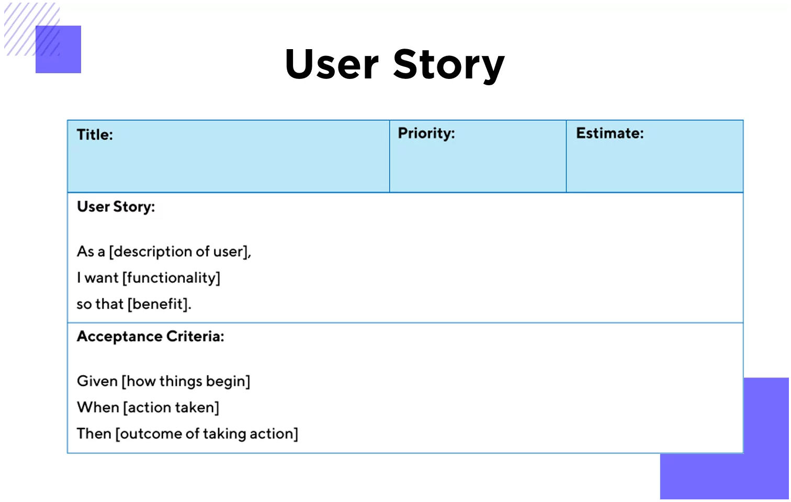

## 실전 사이드 프로젝트 만들어보기

**디자인 영감 Dribble**: https://dribbble.com/shots/14931899-TIGERS

**백그라운드 이미지 만드는 사이트**: https://coolbackgrounds.io/

**프로젝트 전반적으로 쓰인 모든 색상 코드들:**

```
:root {
  --bg-main-color: #00000080;
  --bg-accent-color: #2d2d2d;
  --accent-color: #f64435;
  --text-accent-color: #ffe498;
  --text-edit-bg-color: #575757;
  --border-color: #3f3f3f;
  --shadow-color: #202020;
  --document-bg-color: #68686850;
  --component-bg-gradient: radial-gradient(circle, #646464e6 0%, #363636e6 100%);
  --smokywhite: #dddbd8;
  --black: #000000;
  --translucent-black: #00000099;
}
```

**랜덤 이미지 사이트**: https://picsum.photos/

### 프로젝트 계획을 세우는 테크닉

MoSCoW 방식 (Must have: 있어야 함, Should have: 가져야 함, Could have: 가질 수 있음, Won’t have: 갖지 않음)

1. What are the features
   1. 기능 단위 나열
      1. 필수(must have)
      2. 있으면 좋은(good to have)
      3. 있으면 바람직한(nice to have)
2. What is the roadmap?
   1. 마일스톤별 개발 → 단계별로 프로덕트로 배포 가능한 수준이어야 함

### Project Plan

- **나의 프로젝트 계획**
- https://www.justinmind.com/blog/user-story-examples/
  - **프로젝트 기능들**
    - feature 1
    - feature 2
  - **구현 계획**
    - 첫번째 MS 1 (Must Have)
      - feature 1
      - feature 2
      - ...
    - 두번째 MS 2 (Good to have)
    - 세번째 MS 3 (Nice to have)
  - **어려웠던 부분/ 완성하지 못한 기능들**
    - ...



- must have
  - As a user, I want to add an image
  - As a user, I want to add youtube video
  - As a user, I want to add a note
  - As a user, I want to add todo list
  - As a user, I want to add delete sections
- good to have
  - As a user, I want to reorder sections by dragging
- nice to have
  - As a user, I want to update sections

### Project Structure


- header
- document
- footer
