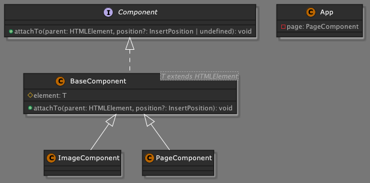

## 실전 사이드 프로젝트 만들어보기

**디자인 영감 Dribble**: https://dribbble.com/shots/14931899-TIGERS

**백그라운드 이미지 만드는 사이트**: https://coolbackgrounds.io/

**프로젝트 전반적으로 쓰인 모든 색상 코드들:**

```
:root {
  --bg-main-color: #00000080;
  --bg-accent-color: #2d2d2d;
  --accent-color: #f64435;
  --text-accent-color: #ffe498;
  --text-edit-bg-color: #575757;
  --border-color: #3f3f3f;
  --shadow-color: #202020;
  --document-bg-color: #68686850;
  --component-bg-gradient: radial-gradient(circle, #646464e6 0%, #363636e6 100%);
  --smokywhite: #dddbd8;
  --black: #000000;
  --translucent-black: #00000099;
}
```

**랜덤 이미지 사이트**: https://picsum.photos/

### 프로젝트 계획을 세우는 테크닉

MoSCoW 방식 (Must have: 있어야 함, Should have: 가져야 함, Could have: 가질 수 있음, Won’t have: 갖지 않음)

1. What are the features
   1. 기능 단위 나열
      1. 필수(must have)
      2. 있으면 좋은(good to have)
      3. 있으면 바람직한(nice to have)
2. What is the roadmap?
   1. 마일스톤별 개발 → 단계별로 프로덕트로 배포 가능한 수준이어야 함

### Project Plan

- **나의 프로젝트 계획**
- https://www.justinmind.com/blog/user-story-examples/
  - **프로젝트 기능들**
    - feature 1
    - feature 2
  - **구현 계획**
    - 첫번째 MS 1 (Must Have)
      - feature 1
      - feature 2
      - ...
    - 두번째 MS 2 (Good to have)
    - 세번째 MS 3 (Nice to have)
  - **어려웠던 부분/ 완성하지 못한 기능들**
    - ...


- must have
  - As a user, I want to add an image
  - As a user, I want to add youtube video
  - As a user, I want to add a note
  - As a user, I want to add todo list
  - As a user, I want to add delete sections
- good to have
  - As a user, I want to reorder sections by dragging
- nice to have
  - As a user, I want to update sections

### Project Structure


- header
- document
- footer

### 프로젝트 환경 설정

`tsconfig.json`

```json
{
  "compilerOptions": {
    "target": "es6" /* Specify ECMAScript target version: 'ES3' (default), 'ES5', 'ES2015', 'ES2016', 'ES2017', 'ES2018', 'ES2019', 'ES2020', or 'ESNEXT'. */,
    "module": "ES2015" /* Specify module code generation: 'none', 'commonjs', 'amd', 'system', 'umd', 'es2015', 'es2020', or 'ESNext'. */,
    "outDir": "./dist" /* Redirect output structure to the directory. */,
    "rootDir": "./src" /* Specify the root directory of input files. Use to control the output directory structure with --outDir. */,
    "removeComments": true /* Do not emit comments to output. */,
    "noEmitOnError": true /* Do not emit outputs if any errors were reported. */,

    /* Strict Type-Checking Options */
    "strict": true /* Enable all strict type-checking options. */,

    /* Additional Checks */
    "noUnusedLocals": true /* Report errors on unused locals. */,
    "noUnusedParameters": true /* Report errors on unused parameters. */,
    "noImplicitReturns": true /* Report error when not all code paths in function return a value. */,
    "noFallthroughCasesInSwitch": true /* Report errors for fallthrough cases in switch statement. */,
    "noUncheckedIndexedAccess": true /* Include 'undefined' in index signature results */,

    /* Module Resolution Options */
    "esModuleInterop": true /* Enables emit interoperability between CommonJS and ES Modules via creation of namespace objects for all imports. Implies 'allowSyntheticDefaultImports'. */,

    /* Advanced Options */
    "skipLibCheck": true /* Skip type checking of declaration files. */,
    "forceConsistentCasingInFileNames": true /* Disallow inconsistently-cased references to the same file. */
  }
}
```

### 프로젝트 구현 플랜

전반적 전략과 흐름

- App
  - App 클래스는 상태를 가지고 있고, 상태를 변화시킬 수 있는 함수로 묶여져 있음
  - header, footer, document로 나뉜다.
  - document ⇒ PageComponent 클래스
    - ImageComponent, NoteComponent, VideoComponent, TodoComponent
- 컴포넌트의 캡슐화, 추상화, 상속, 유연한 확장성을 고려한다.

### Code Refactoring

아래 리팩토링 내용. 복기 필요

- 개선 전
  `./src/app.ts`

  ```tsx
  import { ImageComponent } from './components/page/item/image.js';
  import { PageComponent } from './components/page/page.js';

  class App {
    private readonly page: PageComponent;
    constructor(appRoot: HTMLElement) {
      this.page = new PageComponent();
      this.page.attachTo(appRoot);

      const image = new ImageComponent(
        'Image Title',
        'https://picsum.photos/600/300'
      );
      image.attachTo(appRoot, 'beforeend');
    }
  }

  new App(document.querySelector('.document')! as HTMLElement);
  ```

  `./src/components/page/page.ts`

  ```tsx
  /**
   * PageComponent
   * - PageComponent는 HTMLUListElement를 상속받아 만들어진 커스텀 엘리먼트이다.
   * - PageComponent는 생성자를 통해 생성된 HTMLUListElement를 가지고 있다.
   * - attachTo 메서드를 통해 부모 엘리먼트에 자신의 엘리먼트를 추가할 수 있다.
   */
  export class PageComponent {
    private element: HTMLUListElement;

    constructor() {
      this.element = document.createElement('ul');
      this.element.setAttribute('class', 'page');
      this.element.textContent = 'This is PageComponent';
    }

    // type InsertPosition = "afterbegin" | "afterend" | "beforebegin" | "beforeend";
    attachTo(parent: HTMLElement, position: InsertPosition = 'afterbegin') {
      parent.insertAdjacentElement(position, this.element);
    }
  }
  ```

  `./src/components/page/item/image.ts`

  ```tsx
  /**
   * ImageComponent
   */
  export class ImageComponent {
    private element: HTMLElement;

    constructor(readonly title: string, readonly url: string) {
      const template = document.createElement('template');
      template.innerHTML = `
        <section class="image">
          <div class="image__holder">
            
          </div>
          <p class="image__title"></p>
        </section>`;

      // template.innerHTML로 데이터를 바로 주입하지 않고 필요한 부분만 아래처럼 업데이트 해준다.
      this.element = template.content.firstElementChild! as HTMLElement;
      const imageElement = this.element.querySelector(
        '.image__thumbnail'
      )! as HTMLImageElement;
      imageElement.src = url;
      imageElement.alt = title;

      const titleElement = this.element.querySelector(
        '.image__title'
      )! as HTMLParagraphElement;
      titleElement.textContent = title;
    }

    attachTo(parent: HTMLElement, position: InsertPosition = 'afterbegin') {
      parent.insertAdjacentElement(position, this.element);
    }
  }
  ```

- 개선 후
  위 PageComponent와 ImageComponent에 존재하는 중복 코드. 캡슐화가 필요하다.
  `./src/app.ts` 동일
  `./src/components/component.ts` 공통 로직을 다루는 캡슐화된 기본 BaseComponent 클래스 생성

  ```tsx
  export interface Component {
    // element를 interface에 추가하지 않는 이유 ?
    // - element는 BaseComponent 클래스 내부에서만 사용되기 때문. 외부에서 사용할 필요가 없으므로 알 필요가 없다.
    attachTo(parent: HTMLElement, position?: InsertPosition): void;
  }

  /**
   * BaseComponent 기본 클래스
   * - Encapsulation: HTML 생성을 캡슐화
   */

  // T는 HTMLElement를 상속받는 타입이어야 한다.
  export class BaseComponent<T extends HTMLElement> implements Component {
    protected readonly element: T;

    constructor(htmlString: string) {
      const template = document.createElement('template');
      template.innerHTML = htmlString;
      this.element = template.content.firstElementChild! as T;
    }

    attachTo(parent: HTMLElement, position: InsertPosition = 'afterbegin') {
      parent.insertAdjacentElement(position, this.element);
    }
  }
  ```

  `./src/components/page/page.ts`

  ```tsx
  import { BaseComponent } from '../component.js';

  export class PageComponent extends BaseComponent<HTMLUListElement> {
    constructor() {
      super('<ul class="page">This is PageComponent</ul>');
    }
  }
  ```

  `./src/components/page/item/image.ts`

  ```tsx
  import { BaseComponent } from '../../component.js';

  /**
   * ImageComponent
   */
  export class ImageComponent extends BaseComponent<HTMLElement> {
    constructor(readonly title: string, readonly url: string) {
      super(`
        <section class="image">
          <div class="image__holder">
            
          </div>
          <p class="image__title"></p>
        </section>`);

      const imageElement = this.element.querySelector(
        '.image__thumbnail'
      )! as HTMLImageElement;
      imageElement.src = url;
      imageElement.alt = title;

      const titleElement = this.element.querySelector(
        '.image__title'
      )! as HTMLParagraphElement;
      titleElement.textContent = title;
    }
  }
  ```

  🪄 BaseComponent의 Generic Type, Interface 정의 복기 필요



여러 클래스에 걸쳐 공통적으로 사용되는 코드를 하나의 컴포넌트로 정의해두면,
동일한 코드를 반복할 필요 없이 상속만으로 코드의 중복을 줄이고, 재사용성을 높일 수 있다.

### 페이지 아이템 컨테이너 만들기

각 클래스별 엘리먼트를 공통으로 뿌려주는 PageItemComponent 구현

`src/components/page/page.ts`

```tsx
export interface Composable {
  addChild(child: Component): void;
}

class PageItemComponent
  extends BaseComponent<HTMLLIElement>
  implements Composable
{
  constructor() {
    super(`<li class="page-item">
            <section class="page-item__body"></section>
            <div class="page-item__controls">
              <button class="close">&times;</button>
            </div>
          </li>`);
  }
  addChild(child: Component) {
    const container = this.element.querySelector(
      '.page-item__body'
    )! as HTMLElement;
    child.attachTo(container);
  }
}
```

위 클래스 호출부는 아래 PageComponent에서 addChild 함수 구현 시

`src/componetns/page/page.ts`

```tsx
/**
 * PageComponent
 * - PageComponent는 HTMLUListElement를 상속받아 만들어진 커스텀 엘리먼트이다.
 * - PageComponent는 생성자를 통해 생성된 HTMLUListElement를 가지고 있다.
 * - addChild 메서드는 section을 받아서 PageItemComponent를 생성하고, section을 PageItemComponent에 붙인다.
 */
export class PageComponent
  extends BaseComponent<HTMLUListElement>
  implements Composable
{
  constructor() {
    super('<ul class="page"></ul>');
  }

  addChild(section: Component) {
    const item = new PageItemComponent(); // PageItemComponent를 생성
    item.addChild(section);
    item.attachTo(this.element, 'beforeend'); // 마지막에 붙인다.
  }
}
```

위 변경에 따라 App 클래스 구현부도 아래와 같이 실행

`src/app.ts`

```tsx
//..

class App {
  private readonly page: PageComponent;
  constructor(appRoot: HTMLElement) {
    this.page = new PageComponent();
    this.page.attachTo(appRoot);

    const image = new ImageComponent(
      'Image Title',
      'https://picsum.photos/600/300'
    );
    // image.attachTo(appRoot, 'beforeend');
    this.page.addChild(image);

    const video = new VideoComponent(
      'Video Title',
      'https://www.youtube.com/watch?v=HfaIcB4Ogxk'
    );
    // video.attachTo(appRoot, 'beforeend');
    this.page.addChild(video);

    const note = new NoteComponent('Note Title', 'This is a simple note');
    // note.attachTo(appRoot, 'beforeend');
    this.page.addChild(note);

    const todo = new TodoComponent('Todo Title', 'This is a simple todo item');
    // todo.attachTo(appRoot, 'beforeend');
    this.page.addChild(todo);
  }
}

new App(document.querySelector('.document')! as HTMLElement);
```

기존 BaseComponent에서 정의된 attachTo를 그대로 사용하는 것이 아닌, PageComponent.addChild 함수에서 새롭게 정의된 PageItemComponent 내에 데이터를 주입하는 함수를 공통함수로 구현

### PageItemComponent가 필요한 이유

각 클래스를 한단계 더 감싸는 PageItemComponent가 필요한 이유는 무엇일까?

상위 컴포넌트가 존재하지 않는다면, Note, Image, Video, Todo와 같은 컴포넌트에서 직접 닫힘버튼을 추가하는 등의 액션을 구현해야 함. 사용자가 작성한 정보를 프린트하기 위한 프리뷰 모드나 편집 기능이 없는 읽기 모드 등이 추가 구현된다고 할 때 이러한 기능들을 재사용 가능한 수준으로 올리지 않으면 각 클래스에서 별개로 구현함에 있어 매우 번거로워짐.

때문에 실제 보여지는 컨텐츠와 그것을 감싸서 꾸며주는(닫힘 버튼 등의 공통 기능이 추가된) PageItemComponent 같은 클래스를 별도로 분리함

### Composable 인터페이스가 필요한 이유

- PageComponent는 PageItemComponent와 같은 다른 자식 컴포넌트를 자기 자신 안에 추가할 수 있다.
- PageItemComponent는 실제 컨텐츠 컴포넌트(Note, Image, Video, Todo)들을 자기 자신 안에 추가할 수 있다.

즉, PageComponent도 PageItemComponent도 둘다 다른 자식 컴포넌트를 자기 안에 추가할 수 있는 클래스이므로 공통된 addChild 함수를 따로 Composable이라는 인터페이스로 정의

Component나 Composable 등을 별도의 인터페이스로 정의하는 이유는. 클래스의 관계(커플링)가 복잡해질 때 서로 간의 자세한 사항을. 즉, 클래스 간에 서로의 이름을 알고 있도록 해서 커플링의 수준을 낮추기 위함임.

커플링(Coupling) = 클래스들 간에 서로 지나치게 밀접하게 연관된 상태의 정도를 의미함
커플링이 심하면 유지보수성, 확정성이 떨어진다. (CoffeeMachine이 CheapMilkSteamer만 알고 있으면 영원히 싸구려 스팀기만 써야함..)

때문에 클래스에서 주된 규격 사항들을 인터페이스로 정의해 놓고, 클래스에서 그 인터페이스의 규격을 따라 가도록 구현하면, 사용하는 곳에서(다른 클래스 안에서 이 클래스를 사용하거나, 인자로 전달하거나 등등) 클래스 이름의 타입이 아니라, 인터페이스 이름의 타입으로 지정해두면 다음에 다른 구현사항이 생기면 쉽게 다른 클래스로 변환이 가능함

모든 사용하는 곳으로 찾아가서 타입을 일일이 바꾸지 않아도 되니 좋다.
인터페이스로 정의해서 클래스 간에 인터페이스를 통해 대화하는 것이 좋은 이유..

### 아이템 삭제 기능 구현하기

- closeBtn 내 삭제 이벤트 등록 - PageItemComponent

  - 상위에서 삭제 이벤트가 관리되도록 listener를 전달하는 형태로 구현

  ```tsx
  type OnCloseListener = () => void;

  class PageItemComponent
    extends BaseComponent<HTMLLIElement>
    implements Composable
  {
    // closeListener 라는 private 데이터 정의
    private closeListener?: OnCloseListener | undefined;

    constructor() {
      super(`<li class="page-item">
              <section class="page-item__body"></section>
              <div class="page-item__controls">
                <button class="close">&times;</button>
              </div>
            </li>`);

      // closeBtn을 찾아 삭제 이벤트 등록
      const closeBtn = this.element.querySelector(
        '.close'
      )! as HTMLButtonElement;
      closeBtn.onclick = () => {
        this.closeListener && this.closeListener();
      };
    }
    addChild(child: Component) {
      // ..
    }
    // listener를 외부에서 전달받아 실행시킴 (PageComponent에서 전달받음)
    setOnCloseListener(listener: OnCloseListener) {
      this.closeListener = listener;
    }
  }
  ```

- 삭제 이벤트 listener를 전달하는 주체 - PageComponent

  ```tsx
  export class PageComponent
    extends BaseComponent<HTMLUListElement>
    implements Composable
  {
    constructor() {
      super('<ul class="page"></ul>');
    }

    addChild(section: Component) {
      const item = new PageItemComponent();
      item.addChild(section);
      item.attachTo(this.element, 'beforeend');
      // 삭제 이벤트 listener 전달
      item.setOnCloseListener(() => item.removeFrom(this.element));
    }
  }
  ```

- 삭제 기능의 실제 실행 구현 - BaseComponent

  ```tsx
  export interface Component {
    attachTo(parent: HTMLElement, position?: InsertPosition): void;
    removeFrom(parent: HTMLElement): void; // add
  }

  export class BaseComponent<T extends HTMLElement> implements Component {
    protected readonly element: T;

    constructor(htmlString: string) {
      const template = document.createElement('template');
      template.innerHTML = htmlString;
      this.element = template.content.firstElementChild! as T;
    }

    attachTo(parent: HTMLElement, position: InsertPosition = 'afterbegin') {
      parent.insertAdjacentElement(position, this.element);
    }

    // removeFrom으로 구현
    removeFrom(parent: HTMLElement) {
      // 현재 삭제하려는 parent가 this.element.parentElement와 동일한지 검증
      if (parent !== this.element.parentElement) {
        throw new Error('Parent mismatch!');
      }
      parent.removeChild(this.element); // parent에서 element 삭제
    }
  }
  ```

### dependency Component 인젝션 리팩토링

위 구조에서 PageComponent를 보면, addChild 시 PageItemComponent를 불러와 생성자 함수를 실행함.

`src/component/page/page.ts`

```tsx
export class PageComponent
  extends BaseComponent<HTMLUListElement>
  implements Composable
{
  constructor() {
    super('<ul class="page"></ul>');
  }

  addChild(section: Component) {
    // PageComponent는 PageItemComponent만 생성.
    // 만약 다른 타입의 PageItemComponent가 생겼다면 ??
    // PageComponent를 재사용하면서 원하는 컴포넌트를 생성하도록 리팩토링 해본다.
    const item = new PageItemComponent();
    item.addChild(section);
    item.attachTo(this.element, 'beforeend');
    item.setOnCloseListener(() => item.removeFrom(this.element));
  }
}
```

위와 같이 다양한 타입의 PageItemComponent가 생긴다면, PageComponent를 재사용하기 어려운 구조.
어떻게 하면 다양한 타입을 넣어 구현할 수 있을까? constructor에서 생성자 함수 초기 실행 시 인자로 받아오는 구조로 구현한다면 아래와 같이 할 수 있다.

먼저 PageItemComponent를 인자로 받을 것이므로 PageItemComponent의 타입을 조금 변경한다.

`src/component/page/page.ts`

```tsx
// Component, Composable 타입에서 추가된 SectionContainer 인터페이스 생성
// setOnCloseListener를 타입으로 받아서 처리함.
interface SectionContainer extends Component, Composable {
  setOnCloseListener(listener: OnCloseListener): void;
}

// 다른 모드의 pageItemcomponent가 생성된다면?
// export class DarkModePageItemComponent
// 	extends BaseComponent<HTMLLIElement>
//  implements SectionContainer { ... }

export class PageItemComponent
  extends BaseComponent<HTMLLIElement>
  implements SectionContainer
{
  // SectionContainer 타입 적용
  private closeListener?: OnCloseListener | undefined;

  constructor() {
    super(`<li class="page-item">
            <section class="page-item__body"></section>
            <div class="page-item__controls">
              <button class="close">&times;</button>
            </div>
          </li>`);
    const closeBtn = this.element.querySelector('.close')! as HTMLButtonElement;
    closeBtn.onclick = () => {
      this.closeListener && this.closeListener();
    };
  }

  addChild(child: Component) {
    const container = this.element.querySelector(
      '.page-item__body'
    )! as HTMLElement;
    child.attachTo(container);
  }

  setOnCloseListener(listener: OnCloseListener) {
    this.closeListener = listener;
  }
}
```

위와 같이 기존 Composable 인터페이스를 상속받던 PageItemComponent를 별도의 SectionContainer 인터페이스를 정의하도록 리팩토링. PageComponent 를 아래와 같이 변경한다.

```tsx
// 생성자 함수 타입을 아래와 같이 정의
type SectionContainerConstructor = {
  new (): SectionContainer;
};

export class PageComponent
  extends BaseComponent<HTMLUListElement>
  implements Composable
{
  // 생성자 함수 실행 시 사용할 PageItemComponent를 인자로 받음
  constructor(private pageItemConstructor: SectionContainerConstructor) {
    super('<ul class="page"></ul>');
  }

  addChild(section: Component) {
    // this.pageItemContructor를 통해 인자로 전달받은 PageItemComponent를 실행
    // 어떤 PageItemComponent이든 인터페이스는 언제나 SectionContainer를 만족해야 함
    const item = new this.pageItemConstructor();
    item.addChild(section);
    item.attachTo(this.element, 'beforeend'); // 마지막에 붙인다.
    item.setOnCloseListener(() => item.removeFrom(this.element));
  }
}
```

`src/app.ts`

```tsx
import {
  Composable,
  PageComponent,
  PageItemComponent
} from './components/page/page.js';

class App {
  private readonly page: Component & Composable;
  constructor(appRoot: HTMLElement) {
    // 전달인자로 PageItemComponent를 주입
    this.page = new PageComponent(PageItemComponent);
    this.page.attachTo(appRoot);

    // ..
  }
}

new App(document.querySelector('.document')! as HTMLElement);
```

위와 같이 처리하면 미래에 나오게 될 다양한 PageItemComponent를 수렴할 수 있는 재사용 가능한 PageComponent로의 진화가 가능해짐.. 두번 보자

### 기본 Dialog 컴포넌트 구현하기

`src/components/dialog/dialog.ts`

InputDialog 또한 동적으로 HTML 요소를 생성하므로 BaseComponent를 상속. 다이얼로그 안에 또 다른 컴포넌트(다이얼로그 안에서 사용자에게 보여줄 각 컨텐츠)를 담을 수 있어야 하므로 Composable 인터페이스를 구현함.

```tsx
import { BaseComponent, Component } from '../../components/component.js';
import { Composable } from '../page/page';

type OnCloseListener = () => void;
type OnSubmitListener = () => void;

export class InputDialog
  extends BaseComponent<HTMLElement>
  implements Composable
{
  private closeListener?: OnCloseListener;
  private submitListener?: OnSubmitListener;

  constructor() {
    super(`<section class="dialog">
            <div class="dialog__container">
              <button class="close">&times;</button>
              <div id="dialog__body"></div>
              <button class="dialog__submit">ADD</button>
            </div>
          </section>`);
    const closeBtn = this.element.querySelector('.close')! as HTMLElement;
    // 버튼을 다른 곳에서 활용할 경우 addEventListener를 사용하는 것이 좋다.
    closeBtn.onclick = () => {
      this.closeListener && this.closeListener();
    };

    const submitBtn = this.element.querySelector(
      '.dialog__submit'
    )! as HTMLElement;
    submitBtn.onclick = () => {
      this.submitListener && this.submitListener();
    };
  }

  setOnCloseListener(listener: OnCloseListener): void {
    this.closeListener = listener;
  }

  setOnSubmitListener(listener: OnSubmitListener): void {
    this.submitListener = listener;
  }

  addChild(child: Component): void {
    const body = this.element.querySelector('#dialog__body')! as HTMLElement;
    child.attachTo(body);
  }
}
```

`src/app.ts`

```tsx
// ..
import { InputDialog } from './components/dialog/dialog.js';

class App {
  private readonly page: Component & Composable;
  constructor(appRoot: HTMLElement) {
    this.page = new PageComponent(PageItemComponent);
    this.page.attachTo(appRoot);

    // ..

    // image button에 dialog 이벤트 적용
    const imageBtn = document.querySelector('#new-image')! as HTMLButtonElement;
    imageBtn.addEventListener('click', () => {
      const dialog = new InputDialog();
      // close event 추가
      dialog.setOnCloseListener(() => {
        dialog.removeFrom(document.body);
      });
      // submit event 추가
      dialog.setOnSubmitListener(() => {
        // TODO: 섹션 구현 후 페이지 추가
        dialog.removeFrom(document.body);
      });
      dialog.attachTo(document.body);
    });
  }
}

new App(document.querySelector('.document')! as HTMLElement);
```

eventListener는 dialog에서 직접 구현하는 것이 아닌 이벤트 자체를 인자로 받아서 처리하도록 구성..

즉, InputDialog가 자체적으로 무엇을 보여줄지 결정 or InputDialog가 자체적으로 닫힘 버튼이 눌리면 무엇을 할지 결정하는 로직이 아님. 실제 행동에 대해서는 외부에서 받아와서 사용하므로 어디서 쓰이냐에 따라 유연하게, 재사용성이 높도록 구성하는 것이 포인트임.

### 다이얼로그 컨텐츠 채우기

이제 다이얼로그 내부 컨텐츠를 채우는 일이 남았다.

`src/components/input/media-input.ts`

```tsx
import { BaseComponent } from '../../component.js';

export class MediaSectionInput extends BaseComponent<HTMLElement> {
  constructor() {
    super(`<div>
            <div class="form__container">
              <label for="title">Title</label>
              <input type="text" id="title" />
            </div>
            <div class="form__container">
              <label for="url">URL</label>
              <input type="text" id="url" />
            </div>
          </div>`);
  }

  // getter
  get url(): string {
    const element = this.element.querySelector('#url')! as HTMLInputElement;
    return element.value;
  }
  get title(): string {
    const element = this.element.querySelector('#title')! as HTMLInputElement;
    return element.value;
  }
}
```

`src/components/input/text-input.ts`

```tsx
import { BaseComponent } from '../../component.js';

export class TextSectionInput extends BaseComponent<HTMLElement> {
  constructor() {
    super(`<div>
            <div class="form__container">
              <label for="title">Title</label>
              <input type="text" id="title" />
            </div>
            <div class="form__container">
              <label for="body">Body</label>
              <textarea type="text" row="3" id="body"></textarea>
            </div>
          </div>`);
  }

  // getter
  get body(): string {
    const element = this.element.querySelector('#body')! as HTMLInputElement;
    return element.value;
  }
  get title(): string {
    const element = this.element.querySelector('#title')! as HTMLInputElement;
    return element.value;
  }
}
```

`src/app.ts`

```tsx
// ..
import { InputDialog } from './components/dialog/dialog.js';
import { MediaSectionInput } from './components/dialog/input/media-input.js';
import { TextSectionInput } from './components/dialog/input/text-input.js';

class App {
  private readonly page: Component & Composable;

  constructor(appRoot: HTMLElement, dialogRoot: HTMLElement) {
    this.page = new PageComponent(PageItemComponent);
    this.page.attachTo(appRoot);

    const imageBtn = document.querySelector('#new-image')! as HTMLButtonElement;
    imageBtn.addEventListener('click', () => {
      const dialog = new InputDialog();
      const inputSection = new MediaSectionInput();
      dialog.addChild(inputSection);
      dialog.attachTo(dialogRoot);

      dialog.setOnCloseListener(() => {
        dialog.removeFrom(dialogRoot);
      });
      dialog.setOnSubmitListener(() => {
        const imageComponent = new ImageComponent(
          inputSection.title,
          inputSection.url
        );
        this.page.addChild(imageComponent);
        dialog.removeFrom(dialogRoot);
      });
    });

    const videoBtn = document.querySelector('#new-video')! as HTMLButtonElement;
    videoBtn.addEventListener('click', () => {
      const dialog = new InputDialog();
      const inputSection = new MediaSectionInput();
      dialog.addChild(inputSection);
      dialog.attachTo(dialogRoot);

      dialog.setOnCloseListener(() => {
        dialog.removeFrom(dialogRoot);
      });
      dialog.setOnSubmitListener(() => {
        const videoComponent = new VideoComponent(
          inputSection.title,
          inputSection.url
        );
        this.page.addChild(videoComponent);
        dialog.removeFrom(dialogRoot);
      });
    });

    const noteBtn = document.querySelector('#new-note')! as HTMLButtonElement;
    noteBtn.addEventListener('click', () => {
      const dialog = new InputDialog();
      const inputSection = new TextSectionInput();
      dialog.addChild(inputSection);
      dialog.attachTo(dialogRoot);

      dialog.setOnCloseListener(() => {
        dialog.removeFrom(dialogRoot);
      });
      dialog.setOnSubmitListener(() => {
        const noteComponent = new NoteComponent(
          inputSection.title,
          inputSection.body
        );
        this.page.addChild(noteComponent);
        dialog.removeFrom(dialogRoot);
      });
    });

    const todoBtn = document.querySelector('#new-todo')! as HTMLButtonElement;
    todoBtn.addEventListener('click', () => {
      const dialog = new InputDialog();
      const inputSection = new TextSectionInput();
      dialog.addChild(inputSection);
      dialog.attachTo(dialogRoot);

      dialog.setOnCloseListener(() => {
        dialog.removeFrom(dialogRoot);
      });
      dialog.setOnSubmitListener(() => {
        const todoComponent = new TodoComponent(
          inputSection.title,
          inputSection.body
        );
        this.page.addChild(todoComponent);
        dialog.removeFrom(dialogRoot);
      });
    });
  }
}

new App(document.querySelector('.document')! as HTMLElement, document.body);
```
