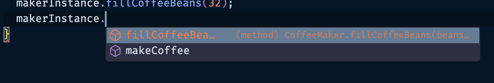

## 객체지향 프로그래밍(OOP) 개념 이해하기

### 명령형, 절차적 프로그래밍

- 하나의 어플리케이션을 만들 때 그 데이터와 함수를 기준으로 프로젝트를 구성하는 것을 의미함
- 함수가 연관된 함수를 실행시키고, 전역 변수에 접근하여 데이터를 변경할 수 있음
- 단점
  - 여러 함수가 전역적으로 사용되므로, 전체 어플리케이션의 이해도가 필요하며, 예상치 못한 사이드 이펙트가 발생할 가능성이 있음
  - 유지보수 어려움, 확장 어려움

### 객체 지향 프로그래밍(Object-Oriented Programming)

- 객체를 지향하는 컨셉으로 프로그래밍 해나가는 방식
- 객체 지향에 대한 컨셉, 관례에 대해 알아보고 실제 적용해보자
- 프로그램을 객체로 정의하여 객체로 서로 의사소통하도록 설계 및 구성하는 방법을 의미함
- 서로 관련있는 데이터와 함수를 여러 객체로 정의해서 프로그래밍
- 문제 발생 시 관련 객체만 이해하고 수정하면 됨
- 여러번 반복되는 기능은 객체를 그대로 재사용할 수 있음
- 새로운 기능이 필요 시 새로운 객체를 생성해서 확장성이 높아진다.

### Object

- 데이터와 함수로 구성
  - 데이터: fields, property로 통칭
  - 함수: methods로 통칭
  - 만약 MediaPlayer 객체라면?
    - data: music
    - function: play, stop..
- 우리 주변에서 볼 수 있는 다양한 개체들을 선정해서 디자인할 수 있음
  - Error, Exception, Event 도 모두 객체로 정의가능
- class
  - template
    - 데이터 정의가 되지 않음. 정의/묘사만 함
  - declare once
  - no data in
- object
  - instance of a class
    - 클래스에 데이터를 넣은 인스턴스
    - 붕어빵 클래스를 이용해 팥 붕어빵 인스턴스를 생성함
  - created many times
  - data in
- 예시
  - class student
    - name: string, score: number, study().. 등 정의
  - object 생성
    - student Vicky instance 생성
    - student Wonny instance 생성

### 객체지향 원칙

클래스 정의, 객체만 만든다고 해서 객체 지향 프로그래밍이라고 할 수 없다.
객체지향의 원칙을 지켜서 개발하는 것이 가장 중요

객체 지향은 아래의 특성을 가진다.

- 캡슐화(Encapsulation)
  - 흩어져있는 관련있는 객체들을 가두는 것을 캡슐화라고 함.
  - 감기약 캡슐 안에 여러 성분의 약이 있는 것과 같음 → 성분을 보지 않고 그냥 먹기만 하면 됨
  - 서로 관련있는 데이터와 함수를 하나의 오브젝트 안에 담아두고 외부에서 볼 필요가 없는 데이터를 잘 숨겨서 캡슐화를 할 수 있음
  - 고양이
    - hungry, full, tired, happy 는 내부 상태(State)
    - play, feed 라는 외부 function을 통해 내부 상태를 변경할 수 있음
- 추상화(Abstraction)
  - 추상성은 내부의 복잡한 기능을 다 이해하지 않고도 외부에서 다양한 인터페이스를 통해 쓸 수 있도록 하는 것을 의미
  - 커피머신
    - 내부 구조를 모두 이해하지 않아도 기계에서 제공하는 버튼만 누르면 커피를 만들 수 있다.
    - 내부 사정을 몰라도 외부에서만 보이는 인터페이스를 이용해 오브젝트를 사용할 수 있도록 하는 것
- 상속성(Inheritance)
  - 상속을 이용하면 오브젝트를 활용해 다양한 오브젝트를 확장해나갈 수 있음
  - coffee machine 을 상속받아 → coffee brewer, espresso machine 이 된다.
  - animal을 상속받아(makeSound) → cat, dog, pig(makeSound 상속)이 된다.
  - HTMLElement → Document. Element. Text → Node → EventTarget
    - 모든 엘리먼트는 EventTarget을 가짐을 알 수 있다.
  - parent ↔ child, super ↔ sub, base ↔ derived 관계로 불림
- 다형성(Polymorphism)
  - 다양한 형태를 의미함
  - coffee machine.makeCoffee → coffee brewer, espresso machine 등 어떤 커피머신인지 알 필요 없이 공통된 makeCoffee 함수에 접근할 수 있는 것을 의미
  - animal.makeSound → cat, dog, pig 등 어떤 동물인지 알 필요 없이 다양한 형태에 공통된 makeSound 를 실행할 수 있는 것을 의미

### 절차지향적으로 커피머신 만들기

```tsx
{
  type CoffeeCup = {
    shots: number;
    hasMilk: boolean;
  };

  const BEANS_GRAMM_PER_SHOT = 7; // 커피를 내릴 때 필요한 원두의 양
  let coffeeBeans: number = 0;
  function makeCoffee(shots: number): CoffeeCup {
    if (coffeeBeans < shots * BEANS_GRAMM_PER_SHOT) {
      throw new Error('Not enough coffee beans!');
    }
    coffeeBeans -= shots * BEANS_GRAMM_PER_SHOT;

    return {
      shots,
      hasMilk: false
    };
  }

  coffeeBeans += 3 * BEANS_GRAMM_PER_SHOT; // 초기 coffeeBeans 수량 정의
  const coffee = makeCoffee(2);
  console.log(coffee); // { shots: 2, hasMilk: false }
}
```

### 객체지향적으로 커피머신 만들기

```tsx
type CoffeeCup = {
  shots: number;
  hasMilk: boolean;
};

class CoffeeMaker {
  static BEANS_GRAMM_PER_SHOT: number = 7; // 중복적으로 사용되는 변수는 class level로 설정
  coffeeBeans: number = 0; // instance (object) level

  // instance를 만들 때 초기에 항상 호출되는 함수
  constructor(coffeeBeans: number) {
    this.coffeeBeans += coffeeBeans; // this.coffeeBeans !== coffeeBeans
  }

  makeCoffee(shots: number): CoffeeCup {
    if (this.coffeeBeans < shots * CoffeeMaker.BEANS_GRAMM_PER_SHOT) {
      throw new Error('Not enough coffee beans!');
    }

    this.coffeeBeans -= shots * CoffeeMaker.BEANS_GRAMM_PER_SHOT;

    return {
      shots,
      hasMilk: false
    };
  }
}

const makerInstance = new CoffeeMaker(32);
console.log(makerInstance); // CoffeeMaker { coffeeBeans: 32 }
console.log(makerInstance.makeCoffee(2)); // { shots: 2, hasMilk: false }

const makerInstance2 = new CoffeeMaker(14);
console.log(makerInstance2); // CoffeeMaker { coffeeBeans: 14 }
```

위처럼 makeInstance 변수를 생성해서 인스턴스를 생성하는 방법 말고 아래와 같이 만들 수도 있음

```tsx
type CoffeeCup = {
  shots: number;
  hasMilk: boolean;
};

class CoffeeMaker {
  static BEANS_GRAMM_PER_SHOT: number = 7;
  coffeeBeans: number = 0;

  // constructor를 사용하지 않고, static method를 사용하여 instance를 생성
  static makeMachine(coffeeBeans: number): CoffeeMaker {
    return new CoffeeMaker(coffeeBeans);
  }

  makeCoffee(shots: number): CoffeeCup {
    // ..
  }
}

const makerInstance = CoffeeMaker.makeMachine(3);
console.log(makerInstance); // CoffeeMaker { coffeeBeans: 3 }
```

반드시 static method로 makeMachine을 선언해야 외부에서 바로 인스턴스를 생성할 수 있음. 참고

### Encapsulation 캡슐화 고도화

위 CoffeeMaker 클래스에는 큰 문제가 있다. 인스턴스가 직접 coffeeBeans의 수를 수정할 수 있다는 것

```tsx
class CoffeeMaker {
  static BEANS_GRAMM_PER_SHOT: number = 7;
  coffeeBeans: number = 0;

  // ..
}

const makerInstance = new CoffeeMaker(32);
console.log(makerInstance); // CoffeeMaker { coffeeBeans: 32 }
makerInstance.coffeeBeans = 3;
console.log(makerInstance); // CoffeeMaker { coffeeBeans: 3 }
makerInstance.coffeeBeans = -34;
console.log(makerInstance); // invalid
```

위와 같이 말이다. 외부에서 보이면 안되는, 외부에서 조정이 불가능하도록 정보를 은닉해본다.

어떻게 구현? public, private, protected를 사용함

```tsx
class CoffeeMaker {
  private static BEANS_GRAMM_PER_SHOT: number = 7;
  private coffeeBeans: number = 0;

  // ..

  // fillCoffeeBeans에서 coffeeBeans를 수정할 수 있음
  fillCoffeeBeans(beans: number) {
    if (beans < 0) {
      throw new Error('value for beans should be greater than 0');
    }

    this.coffeeBeans += beans;
  }
}

const makerInstance = new CoffeeMaker(32);

makerInstance.coffeeBeans = 3; // error
makerInstance.coffeeBeans = -34; // error
```

위와 같이 BEANS_GRAMM_PER_SHOT, coffeeBeans를 private으로 선언함으로써 외부에서 인스턴스에서 접근할 수 없도록 할 수 있다.
`protected`의 경우는 동일하게 외부에서 접근은 불가능하지만 자식 클래스는 접근이 가능하도록 설정할 수 있다.

그럼 이를 활용하는 방식은 뭐가 있을까?

앞서 생성자를 만들기 위해 makeMachine를 만들었는데,
실제 인스턴스를 발생시키는 방법을 makeMachine으로 가두기 위해 활용할 수도 있다.

```tsx
class CoffeeMaker {
  private static BEANS_GRAMM_PER_SHOT: number = 7;
  private coffeeBeans: number = 0;

  // private으로 가려 외부에서 호출할 수 없도록 함
  private constructor(coffeeBeans: number) {
    this.coffeeBeans = coffeeBeans;
  }

  static makeMachine(coffeeBeans: number): CoffeeMaker {
    return new CoffeeMaker(coffeeBeans);
  }

  // ..
}

const makerInstance = new CoffeeMaker(32); // error
const makerInstance = CoffeeMaker.makeMachine(32); // ok
```

이렇듯 캡슐화는 클래스에서 외부/내부에서 접근할 수 있는 것을 명확하게 디자인할 수 있도록 해준다.

### 유용한 Getter와 Setter

```tsx
class User {
  firstName: string;
  lastName: string;
  fullName: string;
  constructor(firstName: string, lastName: string) {
    this.firstName = firstName;
    this.lastName = lastName;
    this.fullName = `${firstName} ${lastName}`;
  }
}

const user = new User('Vicky', 'wonny');
console.log(user.fullName); // Vicky wonny
user.firstName = 'Vickiee';
console.log(user.fullName); // Vicky wonny
```

아래와 같은 User 클래스가 있다고 할 때, user.fullName은 값을 지정해줘도 변경되지 않음. constructor에서만 선언 후 fullName이 갱신되지 않기 때문이다.

이때 Getter를 유용히 사용할 수 있다.

```tsx
class User {
  firstName: string;
  lastName: string;
  get fullName(): string {
    return `${this.firstName} ${this.lastName}`;
  }
  constructor(firstName: string, lastName: string) {
    this.firstName = firstName;
    this.lastName = lastName;
  }
}

const user = new User('Vicky', 'wonny');
console.log(user.fullName); // Vicky wonny
user.firstName = 'Vickiee';
console.log(user.fullName); // Vickiee wonny
```

이렇듯 Getter와 Setter는 일반 변수처럼 사용이 가능하지만 어떠한 계산을 해야할 때 좀 더 유연하게 사용할 수 있다.

또 firstName, lastName과 constructor에서 값을 할당해주는 것이 매우 번거로우므로 아래와 같이 짧게 줄여쓸 수 있다.

```tsx
class User {
  get fullName(): string {
    return `${this.firstName} ${this.lastName}`;
  }

  constructor(private firstName: string, private lastName: string) {
    // 알아서 firstName, lastName이 private 변수로 선언됨
  }
}

const user = new User('Vicky', 'wonny');
console.log(user.fullName); // Vicky wonny
```

class 내 외부에서도 변경 가능한 public 변수는 앞에 public으로 붙이면 됨

```tsx
class User {
  get fullName(): string {
    return `${this.firstName} ${this.lastName}`;
  }
  private internalAge = 4;
  get age(): number {
    return this.internalAge;
  }
  set age(num: number) {
    if (num < 0) {
      throw new Error('Age can not be negative');
    }
    this.internalAge = num;
  }
  constructor(private firstName: string, private lastName: string) {}
}

const user = new User('Vicky', 'wonny');
user.age = 6; // internalAge = 6으로 업데이트
```

Setter로 위와 같이 구현 가능. 멤버 변수 값을 직접 수정하지 않고, Setter를 통해 좀 더 안전하게 검증하고 관리할 수 있게 된다.

### Abstraction 추상화 몸소 느껴보기

클래스를 추상화해보자. 외부에서 클래스를 봤을 때 인터페이스가 너무 복잡했을 때, 추상화를 통해 필요한 인터페이스만 노출하여 클래스를 사용하기 쉽게 만들 수 있다.

복잡한 기계를 간단한 커피머신으로 바꿔주는 것.

이전 시간에 만들었던 CoffeeMaker를 다시 한번 보자

```tsx
type CoffeeCup = {
  shots: number;
  hasMilk: boolean;
};

class CoffeeMaker {
  private static BEANS_GRAMM_PER_SHOT: number = 7;
  private coffeeBeans: number = 0;

  // ..

  grindBeans(shots: number) {
    console.log(`grinding beans for ${shots}`);
    if (this.coffeeBeans < shots * CoffeeMaker.BEANS_GRAMM_PER_SHOT) {
      throw new Error('Not enough coffee beans!');
    }
    this.coffeeBeans -= shots * CoffeeMaker.BEANS_GRAMM_PER_SHOT;
  }

  preheat(): void {
    console.log(`heating up... 🔥`);
  }

  extract(shots: number): CoffeeCup {
    console.log(`Pulling ${shots} shots... ☕️`);
    return {
      shots,
      hasMilk: false
    };
  }

  makeCoffee(shots: number): CoffeeCup {
    this.grindBeans(shots); // 원두를 갈고
    this.preheat(); // 물을 데우고
    return this.extract(shots); // 커피를 추출한다.
  }
}

const makerInstance = CoffeeMaker.makeMachine(32);
makerInstance.fillCoffeeBeans(32);
makerInstance.makeCoffee(2);
```

위와 같이 makeCoffee라는 함수를 3단계의 기능별로 정의했을 때, 실제 하위 CoffeeMaker로 만든 makerInstance에는 grindBeans, preheat, extract 등을 모두 호출할 수 있게된다.


인스턴스는 makeCoffee 함수만 알면 되므로 extract, grindBeans, preheat을 private을 지정해주면 정보은닉 및 추상화가 가능해진다.



인터페이스를 통해서도 추상화를 구현할 수 있다.
인터페이스는 외부에 공개되어야 하는 것들을 명시하고 정의할 때 사용한다.

```tsx
interface CoffeeMaker {
  makeCoffee(shots: number): CoffeeCup;
}

// CoffeeMachine은 CoffeeMaker 인터페이스를 구현하는 클래스이다.
class CoffeeMachine implements CoffeeMaker {
  private static BEANS_GRAMM_PER_SHOT: number = 7;
  private coffeeBeans: number = 0;

  // ..

  fillCoffeeBeans(beans: number) {
    if (beans < 0) {
      throw new Error('value for beans should be greater than 0');
    }

    this.coffeeBeans += beans;
  }

  // private grindBeans, preheat, extract ...

  makeCoffee(shots: number): CoffeeCup {
    this.grindBeans(shots);
    this.preheat();
    return this.extract(shots);
  }
}

// maker는 CoffeeMachine을 반환하는 인스턴스
const maker: CoffeeMachine = CoffeeMachine.makeMachine(32);
maker.fillCoffeeBeans(32); // fillCoffeeBeans 사용 가능
maker.makeCoffee(2);

// maker2는 CoffeeMaker를 반환하는 인스턴스 - CoffeeMachine은 CoffeeMaker를 구현하므로
const maker2: CoffeeMaker = CoffeeMachine.makeMachine(32);
maker2.fillCoffeeBeans(32); // error - CoffeeMaker 내에는 fillCoffeeBeans가 미존재
maker2.makeCoffee(2);
```

위와 같이 maker, maker2가 반환하는 값에 대한 타입을 비교해보자.

maker는 CoffeeMahcine을, maker2는 CoffeeMaker를 반환.

즉, 인터페이스를 이용하면 얼마만큼의 행동을 허용/보장할지 결정할 수 있다.

### interface 더 깊이 알아보기

이번에는 interface를 좀 더 알아보자. 한가지 더 인터페이스를 만들어본다.
상업용 커피머신에 대한 인터페이스가 추가되었다고 가정해보자

```tsx
interface CoffeeMaker {
  makeCoffee(shots: number): CoffeeCup;
}

interface CommercialCoffeeMaker {
  makeCoffee(shots: number): CoffeeCup;
  fillCoffeeBeans(beans: number): void;
  clean(): void;
}

// CoffeeMaker, CommercialCoffeeMaker를 인터페이스로 가짐
// CoffeeMachine 내 clean 함수가 없으면 타입 에러 발생
class CoffeeMachine implements CoffeeMaker, CommercialCoffeeMaker {
  private static BEANS_GRAMM_PER_SHOT: number = 7;
  private coffeeBeans: number = 0;

  // ..
  // private grindBeans, preheat, extract ...

  fillCoffeeBeans(beans: number) {
    // ..
  }

  clean(): void {
    console.log('cleaning the machine... 🧼');
  }

  makeCoffee(shots: number): CoffeeCup {
    // ..
  }
}

const maker2: CommercialCoffeeMaker = CoffeeMachine.makeMachine(32);
maker2.fillCoffeeBeans(32); // ok
maker2.makeCoffee(2); // ok
maker2.clean(); // ok
```

위와 같이 makeCoffee, fillCoffeeBeans, clean을 반환하는 타입 인터페이스를 maker2에 할당하며 3가지 함수에 인스턴스가 접근할 수 있는 것을 확인해볼 수 있다.

위 클래스를 확장하면 아래와 같이 생각해볼 수 있다.

```tsx
class AmateurUser {
  constructor(private machine: CoffeeMaker) {}
  makeCoffee() {
    const coffee = this.machine.makeCoffee(2); // 추가 함수 미존재
    console.log(coffee);
  }
}

class ProBarista {
  constructor(private machine: CommercialCoffeeMaker) {}
  makeCoffee() {
    const coffee = this.machine.makeCoffee(2);
    console.log(coffee);
    this.machine.fillCoffeeBeans(45);
    this.machine.clean();
  }
}

const maker: CoffeeMachine = CoffeeMachine.makeMachine(32);
const amateur = new AmateurUser(maker);
amateur.makeCoffee();
// grinding beans for 2
// heating up... 🔥
// Pulling 2 shots... ☕️
// { shots: 2, hasMilk: false }

const pro = new ProBarista(maker);
pro.makeCoffee();
// grinding beans for 2
// heating up... 🔥
// Pulling 2 shots... ☕️
// { shots: 2, hasMilk: false }
// cleaning the machine... 🧼
```

아마추어 유저, 프로 유저에 따라 실제 커피머신의 기능이 달라진다고 했을 때, constructor내 machine에 부여되는 인터페이스 타입이 달라짐에 따라 실제 인스턴스의 makeCoffee가 수행하는 기능이 달라진다는 것을 알 수 있다. 실제 동작하는 함수의 로그도 달라짐.

이처럼 인터페이스를 통해 클래스의 역할을 정확히 분리하고 제한할 수 있다는 장점. 기억해두자

### Inheritance, 상속

상속에 대해 좀 더 알아보자. animal이란 클래스가 있다고 했을 때, 클래스 내부의 makeSound 함수를 dog, cat, pig라는 자식클래스에서 상속받는다면, 기본 makeSound를 가질 수 있고 각 동물에 맞는 소리가 나도록 커스터마이징 할 수도 있다.

```tsx
type CoffeeCup = {
  shots: number;
  hasMilk: boolean;
};

interface CoffeeMaker {
  makeCoffee(shots: number): CoffeeCup;
}

// CoffeeMachine은 CoffeeMaker interface를 구현하는 클래스
class CoffeeMachine implements CoffeeMaker {
  // ..
  constructor(coffeeBeans: number) {
    this.coffeeBeans = coffeeBeans;
  }

  // ..
}

// CaffeLatteMachine은 CoffeeMachine을 상속받는 클래스(extends 사용)
// CoffeeMachine이 상속하려면 constructor가 protected 혹은 public으로 선언되어야 함
class CaffeLatteMachine extends CoffeeMachine {
  constructor(coffeeBeans: number, public readonly serialNumber: string) {
    super(coffeeBeans);
  }
  private steamMilk(): void {
    console.log('Steaming some milk... 🥛');
  }
  makeCoffee(shots: number): CoffeeCup {
    const coffee = super.makeCoffee(shots); // 부모 클래스의 makeCoffee 함수를 호출
    this.steamMilk();
    return {
      ...coffee,
      hasMilk: true
    };
  }
}

const machine = new CoffeeMachine(23);
const latteMachine = new CaffeLatteMachine(23, '103-S-01');
const coffee = latteMachine.makeCoffee(1);
console.log(coffee);

// grinding beans for 1
// heating up... 🔥
// Pulling 1 shots... ☕️
// Steaming some milk... 🥛
// { shots: 1, hasMilk: true }
```

이처럼 상속을 잘 이용하면 공통적 기능은 그대로 재사용하면서 자식클래스에서만 특화된 기능을 추가해나갈 수 있다.

### Polymorphism 다형성

다형성은 animal 클래스 상속받고 자신의 클래스에 맞게 부모의 함수를 다시 구현함으로써 다형성을 구현해볼 수 있다.

```tsx
class CoffeeMachine implements CoffeeMaker {
  // ..
  makeCoffee(shots: number): CoffeeCup {
    this.grindBeans(shots);
    this.preheat();
    return this.extract(shots);
  }
}

class CaffeLatteMachine extends CoffeeMachine {
  // ..
  makeCoffee(shots: number): CoffeeCup {
    const coffee = super.makeCoffee(shots);
    this.steamMilk();
    return {
      ...coffee,
      hasMilk: true
    };
  }
}

class SweetCoffeeMaker extends CoffeeMachine {
  makeCoffee(shots: number): CoffeeCup {
    const coffee = super.makeCoffee(shots);
    return {
      shots,
      hasSugar: true,
      hasMilk: false
    };
  }
}
```

위와 같이 CoffeeMachine을 부모 클래스로 상속 받은 CaffeLatteMachine과 SweetCoffeeMaker라는 클래스가 있다고 하자. CaffeeLatteMachine, SweetCoffeeMaker에서는 makeCoffee 함수를 상속받아 각 머신의 성격에 맞게 기능을 재 구현하여 사용하고 있다.

```tsx
const machines: CoffeeMachine[] = [
  new CoffeeMachine(16),
  new CaffeLatteMachine(16, '1'),
  new SweetCoffeeMaker(16)
];

// 다형성을 가진 각 machines들은 같은 API를 호출할 수 있으며
// API는 클래스별로 각자 다른 내부 구현사항을 지님
machines.forEach((machine) => {
  console.log('------------------');
  machine.makeCoffee(1);
  machine.clean(); // ok - CoffeeMachine을 상속받으므로
  machine.fillCoffeeBeans(45); // ok - CoffeeMachine을 상속받으므로
});

// ------------------
// grinding beans for 1
// heating up... 🔥
// Pulling 1 shots... ☕️
// cleaning the machine... 🧼
// ------------------
// grinding beans for 1
// heating up... 🔥
// Pulling 1 shots... ☕️
// Steaming some milk... 🥛
// cleaning the machine... 🧼
// ------------------
// grinding beans for 1
// heating up... 🔥
// Pulling 1 shots... ☕️
// cleaning the machine... 🧼
```

다형성의 장점은 내부적으로 구현된 다양한 클래스들이 한가지의 인터페이스를 구현하거나 혹은 동일한 부모 클래스를 상속했을 때, 동일한 함수를 어떤 클래스인지 구분하지 않고 호출할 수 있다는 장점이 있다. 인터페이스와 부모 클래스에 있는 동일한 함수 API를 통해 각 구현된 자식클래스의 내부 구현사항을 디테일하게 신경쓰지 않고도 규약된 API를 호출함으로써 간편하게 다양한 기능을 활용할 수 있게 되는 것이다.

### 상속의 문제

상속의 깊이가 길어질수록 상속 클래스 간 관계는 매우 복잡해질 수 있다.

부모 클래스 수정 시 하위 자식 클래스에 영향이 불가피하며, 추가 기능 개발 시 하위 영향을 고려해야 하므로 복잡도 증가, 한가지 이상의 부모 클래스를 타입스크립트가 지원하지 않는다는 점도 확장성 면에서 문제가 될 수 있다.

```tsx
class SweetCaffeLatteMachine extends SweetCoffeeMaker, CaffeLatteMachine {
	// error - 클래스는 단일 클래스만 확장할 수 있음
}
```

만약 SweetCoffeeMaker, CaffeLatteMachine가 합쳐진 SweetCaffeLatteMachine가 만들고 싶다고 할 때 어떻게 해야할까? 앞서 배운 상속만으로는 단일 클래스로만 확장이 가능한 구조이므로 구현이 어려운 상황에 놓일 수 있다.

### Composition

위와 같은 상황에서 우리는 composition을 고려해볼 수 있다.
필요한 것만을 가져와 조립할 수 있는 것을 composition이라고 한다.

이전 시간에 만든 CaffeLatteMachine와 SweetCoffeeMaker를 보자

```tsx
class CaffeLatteMachine extends CoffeeMachine {
  // ..

  // steamMilk 추가
  private steamMilk(): void {
    console.log('Steaming some milk... 🥛');
  }
  makeCoffee(shots: number): CoffeeCup {
    const coffee = super.makeCoffee(shots);
    this.steamMilk();
    return {
      ...coffee,
      hasMilk: true
    };
  }
}

class SweetCoffeeMaker extends CoffeeMachine {
  // ..

  // getSugar 추가
  getSugar() {
    console.log('Getting some sugar...🍭');
  }
  makeCoffee(shots: number): CoffeeCup {
    const coffee = super.makeCoffee(shots);
    this.getSugar();
    return {
      shots,
      hasSugar: true,
      hasMilk: false
    };
  }
}
```

위 클래스에는 각 머신별로 steamMilk, getSugar 등의 상세 기능 단위로 묶인 함수들이 클래스 내부에 묶여있다.
만약 SweetCaffeLatteMachine를 만든다면, steamMilk, getSugar 등의 함수가 모두 필요한데, 단일 클래스만 상속이 가능한 구조라면 위 기능들의 일부는 SweetCaffeLatteMachine 클래스 내부에 별개로 생성해야 함

그건 너무 복잡하다. 이때 composition을 아래와 같이 구현해볼 수 있다.

1. 상세 기능을 정의한 기능 단위 클래스 생성
1. 해당 기능 클래스를 필요한 클래스에서 composition

위와 같이하면 기존 CoffeeCup 객체를 리턴하는 로직을 각 상세 클래스가 가지고 가도록 구현할 수 있음
또한, 각 상세 기능을 중복하여 작업할 필요가 없으므로 매우 간단하다.

이제 composition을 활용해서 SweetCaffeLatteMachine를 간단하게 구현할 수 있음

```tsx
class SweetCaffeLatteMachine extends CoffeeMachine {
  constructor(
    private beans: number,
    private milk: CheapMilkSteamer,
    private sugar: AutomaticSugarMixer
  ) {
    super(beans);
  }
  makeCoffee(shots: number): CoffeeCup {
    const coffee = super.makeCoffee(shots);
    const sugarAdded = this.sugar.addSugar(coffee);
    return this.milk.makeMilk(sugarAdded);
  }
}
```

그런데 위 구조에서 치명적인 단점이 있음. CaffeLatteMachine와 SweetCoffeeMaker, SweetCaffeLatteMachine 모두 CheapMilkSteamer, AutomaticSugarMixer에 대한 의존성이 깊음

다른 스티머, 다른 설탕 제조기를 사용하고 싶다면 클래스 로직 자체를 수정해야 함. 이용에 제한이 생김
서로 다른 클래스 간에 서로 잘 알고 지내는 것은 좋지 않음. 어디서 어떤 재료가 붙는지 클래스가 알지 못하도록 하는 것이 바람직하다.

### 강력한 Interface

지난 시간 composition을 통해 복잡한 상속의 수직 구조를 피해 상속의 레벨을 1단계로 유지하면서 필요한 코드를 재사용하는 방법에 대해 알아보았다. 한 가지 문제점은 가져다 쓰는 클래스가 서로 간 강한 결합도로 인해 클래스의 값이 변경되거나 메서드를 교체하고 싶어도 한가지만 수정이 되면 클래스를 사용하는 모든 것들을 업데이트 해야하는 문제점이 있었다.

만약 비싼 우유 거품기를 사용하고 싶다면? 비싼 설탕을 넣고 싶다면? 차가운 우유 거품기를 넣고 싶다면 어떻게 할까?
그때마다 클래스를 새로 만들어야 하는 건 옳지 않다. 클래스 간 서로 상호작용을 하는 경우 클래스 자신을 노출하지 않고 인터페이스라는 계약서에 의거해 의사소통하는 것이 좋다.

아래와 같이 interface를 정의한다.

```tsx
interface MilkFrother {
  makeMilk(cup: CoffeeCup): CoffeeCup;
}

interface SugarProvider {
  addSugar(cup: CoffeeCup): CoffeeCup;
}
```

이후 다양한 우유 거품기도 만들어보자

```tsx
// 싸구려 우유 거품기 - MilkFrother 인터페이스와 연결
class CheapMilkSteamer implements MilkFrother {
  private steamMilk(): void {
    console.log('Steaming some milk... 🥛');
  }
  makeMilk(cup: CoffeeCup): CoffeeCup {
    this.steamMilk();
    return {
      ...cup,
      hasMilk: true
    };
  }
}

// 고급 우유 거품기 - MilkFrother 인터페이스와 연결
class FancyMilkSteamer implements MilkFrother {
  private steamMilk(): void {
    console.log('Fancy Steaming some milk... 🥛');
  }
  makeMilk(cup: CoffeeCup): CoffeeCup {
    this.steamMilk();
    return {
      ...cup,
      hasMilk: true
    };
  }
}

// 차가운 우유 거품기 - MilkFrother 인터페이스와 연결
class ColdMilkSteamer implements MilkFrother {
  private steamMilk(): void {
    console.log('Fancy Steaming some milk... 🥛');
  }
  makeMilk(cup: CoffeeCup): CoffeeCup {
    this.steamMilk();
    return {
      ...cup,
      hasMilk: true
    };
  }
}
```

다양한 설탕 제조기도 만든다.

```tsx
// 설탕 제조기 - SugarProvider 인터페이스와 연결
class CandySugarMixer implements SugarProvider {
  private getSugar() {
    console.log('Getting some sugar from candy 🍭');
    return true;
  }
  addSugar(cup: CoffeeCup): CoffeeCup {
    const sugar = this.getSugar();
    return {
      ...cup,
      hasSugar: sugar
    };
  }
}

// 제대로 된 설탕 제조기 - SugarProvider 인터페이스와 연결
class SugarMixer implements SugarProvider {
  private getSugar() {
    console.log('Getting some sugar from jar 🍭');
    return true;
  }
  addSugar(cup: CoffeeCup): CoffeeCup {
    const sugar = this.getSugar();
    return {
      ...cup,
      hasSugar: sugar
    };
  }
}
```

이후 각 `CaffeLatteMachine`, `SweetCoffeeMaker`, `SweetCaffeLatteMachine`의 우유 거품기와 설탕들에 대한 타입 정의를 인터페이스로 바꿔준다.

```tsx
class CaffeLatteMachine extends CoffeeMachine {
  constructor(
    coffeeBeans: number,
    public readonly serialNumber: string,
    private milkFrother: MilkFrother // interface
  ) {
    super(coffeeBeans);
  }
  // ..
}

class SweetCoffeeMaker extends CoffeeMachine {
  constructor(
    beans: number,
    private sugar: SugarProvider // interface
  ) {
    super(beans);
  }
  // ..
}

class SweetCaffeLatteMachine extends CoffeeMachine {
  constructor(
    private beans: number,
    private milk: MilkFrother, // interface
    private sugar: SugarProvider // interface
  ) {
    super(beans);
  }
  // ..
}
```

위와 같이 하면 아래와 같은 구현이 가능해진다!

```tsx
// milk
const cheapMilkMaker = new CheapMilkSteamer();
const fancyMilkMaker = new FancyMilkSteamer();
const coldMilkMaker = new ColdMilkSteamer();

// sugar
const candySugar = new CandySugarMixer();
const sugar = new SugarMixer();

const sweetCandyMachine = new SweetCoffeeMaker(12, candySugar);
const sweetMachine = new SweetCoffeeMaker(12, sugar);

const latteMachine = new CaffeLatteMachine(12, 'ss', cheapMilkMaker);
const coldLatteMachine = new CaffeLatteMachine(12, 'ss', coldMilkMaker);

const sweetLatteMachine = new SweetCaffeLatteMachine(
  12,
  cheapMilkMaker,
  candySugar
);
const candyLatteMachine = new SweetCaffeLatteMachine(12, fancyMilkMaker, sugar);
```

다양한 타입의 기능 클래스를 연결해서 인스턴스를 구현할 수 있게 되었음!
우리가 원하는 기능을 조립해서 어떤 커피기계를 만들 것인지 다양하게 설계가 가능해진 것이다.

### 한가지 더

우리가 필요한 기능들을 클래스와 인터페이스로 정의했다.

사용하는 사람들은 어떤 것이 전달되는지 알 필요가 없고, 정의된, 규약된 인터페이스로만 구현이 되면 원하는 다른 부품의 형태로 원하는 용도에 맞게 쓸 수 있게 된 것이다.

여기서 한가지 더 생각해보자. 사실 위 SweetCoffeeMaker, CaffeLatteMachine, SweetCaffeLatteMachine는 필요치 않다. 클래스로 확장없이 CoffeeMachine로만 구현이 가능한 것이다.

일단 작은 기능 단위를 묶은 클래스 중 noMilk, noSugar 클래스를 추가해주자

```tsx
// 우유 없음
class NoMilk implements MilkFrother {
  makeMilk(cup: CoffeeCup): CoffeeCup {
    return cup;
  }
}

// 설탕 없음
class NoSugar implements SugarProvider {
  addSugar(cup: CoffeeCup): CoffeeCup {
    return cup;
  }
}
```

그리고 CoffeeMachine을 아래와 같이 리팩토링 해본다.

```tsx
class CoffeeMachine implements CoffeeMaker {
  private static BEANS_GRAMM_PER_SHOT: number = 7;
  private coffeeBeans: number = 0;

  // MilkFrother, SugarProvider 추가
  constructor(
    coffeeBeans: number,
    private milk: MilkFrother,
    private sugar: SugarProvider
  ) {
    this.coffeeBeans = coffeeBeans;
  }

  fillCoffeeBeans(beans: number) {
    // ..
  }

  clean(): void {
    // ..
  }

  private grindBeans(shots: number) {
    // ..
  }

  private preheat(): void {
    // ..
  }

  private extract(shots: number): CoffeeCup {
    // ..
  }

  makeCoffee(shots: number): CoffeeCup {
    this.grindBeans(shots);
    this.preheat();
    const coffee = this.makeCoffee(shots);
    const sugarAdded = this.sugar.addSugar(coffee);
    return this.milk.makeMilk(sugarAdded);
  }
}
```

위와 같이 constructor에 정의된 클래스에 대한 값을 추가해준 뒤 아래와 같이 인스턴스를 생성해보자

```tsx
// const sweetCandyMachine = new SweetCoffeeMaker(12, candySugar);
const sweetCandyMachine = new CoffeeMachine(12, noMilk, candySugar);
// const sweetMachine = new SweetCoffeeMaker(12, sugar);
const sweetMachine = new CoffeeMachine(12, noMilk, sugar);

// const latteMachine = new CaffeLatteMachine(12, 'ss', cheapMilkMaker);
const latteMachine = new CoffeeMachine(12, cheapMilkMaker, noSugar);
// const coldLatteMachine = new CaffeLatteMachine(12, 'ss', coldMilkMaker);
const coldLatteMachine = new CoffeeMachine(12, coldMilkMaker, noSugar);
// const sweetLatteMachine = new SweetCaffeLatteMachine(12, cheapMilkMaker, candySugar);
const sweetLatteMachine = new CoffeeMachine(12, cheapMilkMaker, candySugar);
```

위와 같이 하면 CoffeeMachine 클래스 하나로 다양한 타입의 machine instance를 생성할 수 있다. 원하는 다양한 객체를 설계할 수 있는 것이다.

단, composition이 대세이고 상속이 유용하지 않다는 것이 아님
수직적인 관계가 깊진 않은지 항상 주의깊게 보고 composition을 통해 확장이 가능하고 재사용성이 높아지고, 또, 퀄리티 높은 코드를 만들기 위해 고민하고 개선해보는 과정이 중요하다.

오버 프로그래밍은 좋지 않다. 일정과 설계 방향에 맞춰 합리적인 방식을 선택해서 개발할 수 있어야 함
