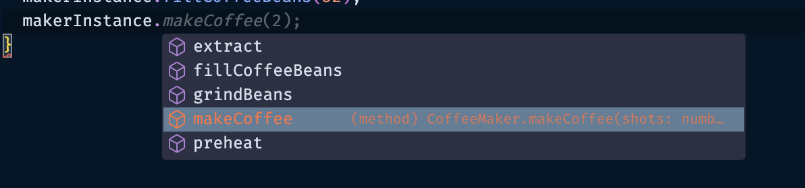

## 객체지향 프로그래밍(OOP) 개념 이해하기

### 명령형, 절차적 프로그래밍

- 하나의 어플리케이션을 만들 때 그 데이터와 함수를 기준으로 프로젝트를 구성하는 것을 의미함
- 함수가 연관된 함수를 실행시키고, 전역 변수에 접근하여 데이터를 변경할 수 있음
- 단점
  - 여러 함수가 전역적으로 사용되므로, 전체 어플리케이션의 이해도가 필요하며, 예상치 못한 사이드 이펙트가 발생할 가능성이 있음
  - 유지보수 어려움, 확장 어려움

### 객체 지향 프로그래밍(Object-Oriented Programming)

- 객체를 지향하는 컨셉으로 프로그래밍 해나가는 방식
- 객체 지향에 대한 컨셉, 관례에 대해 알아보고 실제 적용해보자
- 프로그램을 객체로 정의하여 객체로 서로 의사소통하도록 설계 및 구성하는 방법을 의미함
- 서로 관련있는 데이터와 함수를 여러 객체로 정의해서 프로그래밍
- 문제 발생 시 관련 객체만 이해하고 수정하면 됨
- 여러번 반복되는 기능은 객체를 그대로 재사용할 수 있음
- 새로운 기능이 필요 시 새로운 객체를 생성해서 확장성이 높아진다.

### Object

- 데이터와 함수로 구성
  - 데이터: fields, property로 통칭
  - 함수: methods로 통칭
  - 만약 MediaPlayer 객체라면?
    - data: music
    - function: play, stop..
- 우리 주변에서 볼 수 있는 다양한 개체들을 선정해서 디자인할 수 있음
  - Error, Exception, Event 도 모두 객체로 정의가능
- class
  - template
    - 데이터 정의가 되지 않음. 정의/묘사만 함
  - declare once
  - no data in
- object
  - instance of a class
    - 클래스에 데이터를 넣은 인스턴스
    - 붕어빵 클래스를 이용해 팥 붕어빵 인스턴스를 생성함
  - created many times
  - data in
- 예시
  - class student
    - name: string, score: number, study().. 등 정의
  - object 생성
    - student Vicky instance 생성
    - student Wonny instance 생성

### 객체지향 원칙

클래스 정의, 객체만 만든다고 해서 객체 지향 프로그래밍이라고 할 수 없다.
객체지향의 원칙을 지켜서 개발하는 것이 가장 중요

객체 지향은 아래의 특성을 가진다.

- 캡슐화(Encapsulation)
  - 흩어져있는 관련있는 객체들을 가두는 것을 캡슐화라고 함.
  - 감기약 캡슐 안에 여러 성분의 약이 있는 것과 같음 → 성분을 보지 않고 그냥 먹기만 하면 됨
  - 서로 관련있는 데이터와 함수를 하나의 오브젝트 안에 담아두고 외부에서 볼 필요가 없는 데이터를 잘 숨겨서 캡슐화를 할 수 있음
  - 고양이
    - hungry, full, tired, happy 는 내부 상태(State)
    - play, feed 라는 외부 function을 통해 내부 상태를 변경할 수 있음
- 추상화(Abstraction)
  - 추상성은 내부의 복잡한 기능을 다 이해하지 않고도 외부에서 다양한 인터페이스를 통해 쓸 수 있도록 하는 것을 의미
  - 커피머신
    - 내부 구조를 모두 이해하지 않아도 기계에서 제공하는 버튼만 누르면 커피를 만들 수 있다.
    - 내부 사정을 몰라도 외부에서만 보이는 인터페이스를 이용해 오브젝트를 사용할 수 있도록 하는 것
- 상속성(Inheritance)
  - 상속을 이용하면 오브젝트를 활용해 다양한 오브젝트를 확장해나갈 수 있음
  - coffee machine 을 상속받아 → coffee brewer, espresso machine 이 된다.
  - animal을 상속받아(makeSound) → cat, dog, pig(makeSound 상속)이 된다.
  - HTMLElement → Document. Element. Text → Node → EventTarget
    - 모든 엘리먼트는 EventTarget을 가짐을 알 수 있다.
  - parent ↔ child, super ↔ sub, base ↔ derived 관계로 불림
- 다형성(Polymorphism)
  - 다양한 형태를 의미함
  - coffee machine.makeCoffee → coffee brewer, espresso machine 등 어떤 커피머신인지 알 필요 없이 공통된 makeCoffee 함수에 접근할 수 있는 것을 의미
  - animal.makeSound → cat, dog, pig 등 어떤 동물인지 알 필요 없이 다양한 형태에 공통된 makeSound 를 실행할 수 있는 것을 의미

### 절차지향적으로 커피머신 만들기

```tsx
{
  type CoffeeCup = {
    shots: number;
    hasMilk: boolean;
  };

  const BEANS_GRAMM_PER_SHOT = 7; // 커피를 내릴 때 필요한 원두의 양
  let coffeeBeans: number = 0;
  function makeCoffee(shots: number): CoffeeCup {
    if (coffeeBeans < shots * BEANS_GRAMM_PER_SHOT) {
      throw new Error('Not enough coffee beans!');
    }
    coffeeBeans -= shots * BEANS_GRAMM_PER_SHOT;

    return {
      shots,
      hasMilk: false
    };
  }

  coffeeBeans += 3 * BEANS_GRAMM_PER_SHOT; // 초기 coffeeBeans 수량 정의
  const coffee = makeCoffee(2);
  console.log(coffee); // { shots: 2, hasMilk: false }
}
```

### 객체지향적으로 커피머신 만들기

```tsx
type CoffeeCup = {
  shots: number;
  hasMilk: boolean;
};

class CoffeeMaker {
  static BEANS_GRAMM_PER_SHOT: number = 7; // 중복적으로 사용되는 변수는 class level로 설정
  coffeeBeans: number = 0; // instance (object) level

  // instance를 만들 때 초기에 항상 호출되는 함수
  constructor(coffeeBeans: number) {
    this.coffeeBeans += coffeeBeans; // this.coffeeBeans !== coffeeBeans
  }

  makeCoffee(shots: number): CoffeeCup {
    if (this.coffeeBeans < shots * CoffeeMaker.BEANS_GRAMM_PER_SHOT) {
      throw new Error('Not enough coffee beans!');
    }

    this.coffeeBeans -= shots * CoffeeMaker.BEANS_GRAMM_PER_SHOT;

    return {
      shots,
      hasMilk: false
    };
  }
}

const makerInstance = new CoffeeMaker(32);
console.log(makerInstance); // CoffeeMaker { coffeeBeans: 32 }
console.log(makerInstance.makeCoffee(2)); // { shots: 2, hasMilk: false }

const makerInstance2 = new CoffeeMaker(14);
console.log(makerInstance2); // CoffeeMaker { coffeeBeans: 14 }
```

위처럼 makeInstance 변수를 생성해서 인스턴스를 생성하는 방법 말고 아래와 같이 만들 수도 있음

```tsx
type CoffeeCup = {
  shots: number;
  hasMilk: boolean;
};

class CoffeeMaker {
  static BEANS_GRAMM_PER_SHOT: number = 7;
  coffeeBeans: number = 0;

  // constructor를 사용하지 않고, static method를 사용하여 instance를 생성
  static makeMachine(coffeeBeans: number): CoffeeMaker {
    return new CoffeeMaker(coffeeBeans);
  }

  makeCoffee(shots: number): CoffeeCup {
    // ..
  }
}

const makerInstance = CoffeeMaker.makeMachine(3);
console.log(makerInstance); // CoffeeMaker { coffeeBeans: 3 }
```

반드시 static method로 makeMachine을 선언해야 외부에서 바로 인스턴스를 생성할 수 있음. 참고

### Encapsulation 캡슐화 고도화

위 CoffeeMaker 클래스에는 큰 문제가 있다. 인스턴스가 직접 coffeeBeans의 수를 수정할 수 있다는 것

```tsx
class CoffeeMaker {
  static BEANS_GRAMM_PER_SHOT: number = 7;
  coffeeBeans: number = 0;

  // ..
}

const makerInstance = new CoffeeMaker(32);
console.log(makerInstance); // CoffeeMaker { coffeeBeans: 32 }
makerInstance.coffeeBeans = 3;
console.log(makerInstance); // CoffeeMaker { coffeeBeans: 3 }
makerInstance.coffeeBeans = -34;
console.log(makerInstance); // invalid
```

위와 같이 말이다. 외부에서 보이면 안되는, 외부에서 조정이 불가능하도록 정보를 은닉해본다.

어떻게 구현? public, private, protected를 사용함

```tsx
class CoffeeMaker {
  private static BEANS_GRAMM_PER_SHOT: number = 7;
  private coffeeBeans: number = 0;

  // ..

  // fillCoffeeBeans에서 coffeeBeans를 수정할 수 있음
  fillCoffeeBeans(beans: number) {
    if (beans < 0) {
      throw new Error('value for beans should be greater than 0');
    }

    this.coffeeBeans += beans;
  }
}

const makerInstance = new CoffeeMaker(32);

makerInstance.coffeeBeans = 3; // error
makerInstance.coffeeBeans = -34; // error
```

위와 같이 BEANS_GRAMM_PER_SHOT, coffeeBeans를 private으로 선언함으로써 외부에서 인스턴스에서 접근할 수 없도록 할 수 있다.
`protected`의 경우는 동일하게 외부에서 접근은 불가능하지만 자식 클래스는 접근이 가능하도록 설정할 수 있다.

그럼 이를 활용하는 방식은 뭐가 있을까?

앞서 생성자를 만들기 위해 makeMachine를 만들었는데,
실제 인스턴스를 발생시키는 방법을 makeMachine으로 가두기 위해 활용할 수도 있다.

```tsx
class CoffeeMaker {
  private static BEANS_GRAMM_PER_SHOT: number = 7;
  private coffeeBeans: number = 0;

  // private으로 가려 외부에서 호출할 수 없도록 함
  private constructor(coffeeBeans: number) {
    this.coffeeBeans = coffeeBeans;
  }

  static makeMachine(coffeeBeans: number): CoffeeMaker {
    return new CoffeeMaker(coffeeBeans);
  }

  // ..
}

const makerInstance = new CoffeeMaker(32); // error
const makerInstance = CoffeeMaker.makeMachine(32); // ok
```

이렇듯 캡슐화는 클래스에서 외부/내부에서 접근할 수 있는 것을 명확하게 디자인할 수 있도록 해준다.

### 유용한 Getter와 Setter

```tsx
class User {
  firstName: string;
  lastName: string;
  fullName: string;
  constructor(firstName: string, lastName: string) {
    this.firstName = firstName;
    this.lastName = lastName;
    this.fullName = `${firstName} ${lastName}`;
  }
}

const user = new User('Vicky', 'wonny');
console.log(user.fullName); // Vicky wonny
user.firstName = 'Vickiee';
console.log(user.fullName); // Vicky wonny
```

아래와 같은 User 클래스가 있다고 할 때, user.fullName은 값을 지정해줘도 변경되지 않음. constructor에서만 선언 후 fullName이 갱신되지 않기 때문이다.

이때 Getter를 유용히 사용할 수 있다.

```tsx
class User {
  firstName: string;
  lastName: string;
  get fullName(): string {
    return `${this.firstName} ${this.lastName}`;
  }
  constructor(firstName: string, lastName: string) {
    this.firstName = firstName;
    this.lastName = lastName;
  }
}

const user = new User('Vicky', 'wonny');
console.log(user.fullName); // Vicky wonny
user.firstName = 'Vickiee';
console.log(user.fullName); // Vickiee wonny
```

이렇듯 Getter와 Setter는 일반 변수처럼 사용이 가능하지만 어떠한 계산을 해야할 때 좀 더 유연하게 사용할 수 있다.

또 firstName, lastName과 constructor에서 값을 할당해주는 것이 매우 번거로우므로 아래와 같이 짧게 줄여쓸 수 있다.

```tsx
class User {
  get fullName(): string {
    return `${this.firstName} ${this.lastName}`;
  }

  constructor(private firstName: string, private lastName: string) {
    // 알아서 firstName, lastName이 private 변수로 선언됨
  }
}

const user = new User('Vicky', 'wonny');
console.log(user.fullName); // Vicky wonny
```

class 내 외부에서도 변경 가능한 public 변수는 앞에 public으로 붙이면 됨

```tsx
class User {
  get fullName(): string {
    return `${this.firstName} ${this.lastName}`;
  }
  private internalAge = 4;
  get age(): number {
    return this.internalAge;
  }
  set age(num: number) {
    if (num < 0) {
      throw new Error('Age can not be negative');
    }
    this.internalAge = num;
  }
  constructor(private firstName: string, private lastName: string) {}
}

const user = new User('Vicky', 'wonny');
user.age = 6; // internalAge = 6으로 업데이트
```

Setter로 위와 같이 구현 가능. 멤버 변수 값을 직접 수정하지 않고, Setter를 통해 좀 더 안전하게 검증하고 관리할 수 있게 된다.

### Abstraction 추상화 몸소 느껴보기

클래스를 추상화해보자. 외부에서 클래스를 봤을 때 인터페이스가 너무 복잡했을 때, 추상화를 통해 필요한 인터페이스만 노출하여 클래스를 사용하기 쉽게 만들 수 있다.

복잡한 기계를 간단한 커피머신으로 바꿔주는 것.

이전 시간에 만들었던 CoffeeMaker를 다시 한번 보자

```tsx
type CoffeeCup = {
  shots: number;
  hasMilk: boolean;
};

class CoffeeMaker {
  private static BEANS_GRAMM_PER_SHOT: number = 7;
  private coffeeBeans: number = 0;

  // ..

  grindBeans(shots: number) {
    console.log(`grinding beans for ${shots}`);
    if (this.coffeeBeans < shots * CoffeeMaker.BEANS_GRAMM_PER_SHOT) {
      throw new Error('Not enough coffee beans!');
    }
    this.coffeeBeans -= shots * CoffeeMaker.BEANS_GRAMM_PER_SHOT;
  }

  preheat(): void {
    console.log(`heating up... 🔥`);
  }

  extract(shots: number): CoffeeCup {
    console.log(`Pulling ${shots} shots... ☕️`);
    return {
      shots,
      hasMilk: false
    };
  }

  makeCoffee(shots: number): CoffeeCup {
    this.grindBeans(shots); // 원두를 갈고
    this.preheat(); // 물을 데우고
    return this.extract(shots); // 커피를 추출한다.
  }
}

const makerInstance = CoffeeMaker.makeMachine(32);
makerInstance.fillCoffeeBeans(32);
makerInstance.makeCoffee(2);
```

위와 같이 makeCoffee라는 함수를 3단계의 기능별로 정의했을 때, 실제 하위 CoffeeMaker로 만든 makerInstance에는 grindBeans, preheat, extract 등을 모두 호출할 수 있게된다.



인스턴스는 makeCoffee 함수만 알면 되므로 extract, grindBeans, preheat을 private을 지정해주면 정보은닉 및 추상화가 가능해진다.


인터페이스를 통해서도 추상화를 구현할 수 있다.
인터페이스는 외부에 공개되어야 하는 것들을 명시하고 정의할 때 사용한다.

```tsx
interface CoffeeMaker {
  makeCoffee(shots: number): CoffeeCup;
}

// CoffeeMachine은 CoffeeMaker 인터페이스를 구현하는 클래스이다.
class CoffeeMachine implements CoffeeMaker {
  private static BEANS_GRAMM_PER_SHOT: number = 7;
  private coffeeBeans: number = 0;

  // ..

  fillCoffeeBeans(beans: number) {
    if (beans < 0) {
      throw new Error('value for beans should be greater than 0');
    }

    this.coffeeBeans += beans;
  }

  // private grindBeans, preheat, extract ...

  makeCoffee(shots: number): CoffeeCup {
    this.grindBeans(shots);
    this.preheat();
    return this.extract(shots);
  }
}

// maker는 CoffeeMachine을 반환하는 인스턴스
const maker: CoffeeMachine = CoffeeMachine.makeMachine(32);
maker.fillCoffeeBeans(32); // fillCoffeeBeans 사용 가능
maker.makeCoffee(2);

// maker2는 CoffeeMaker를 반환하는 인스턴스 - CoffeeMachine은 CoffeeMaker를 구현하므로
const maker2: CoffeeMaker = CoffeeMachine.makeMachine(32);
maker2.fillCoffeeBeans(32); // error - CoffeeMaker 내에는 fillCoffeeBeans가 미존재
maker2.makeCoffee(2);
```

위와 같이 maker, maker2가 반환하는 값에 대한 타입을 비교해보자.

maker는 CoffeeMahcine을, maker2는 CoffeeMaker를 반환.

즉, 인터페이스를 이용하면 얼마만큼의 행동을 허용/보장할지 결정할 수 있다.

### interface 더 깊이 알아보기

이번에는 interface를 좀 더 알아보자. 한가지 더 인터페이스를 만들어본다.
상업용 커피머신에 대한 인터페이스가 추가되었다고 가정해보자

```tsx
interface CoffeeMaker {
  makeCoffee(shots: number): CoffeeCup;
}

interface CommercialCoffeeMaker {
  makeCoffee(shots: number): CoffeeCup;
  fillCoffeeBeans(beans: number): void;
  clean(): void;
}

// CoffeeMaker, CommercialCoffeeMaker를 인터페이스로 가짐
// CoffeeMachine 내 clean 함수가 없으면 타입 에러 발생
class CoffeeMachine implements CoffeeMaker, CommercialCoffeeMaker {
  private static BEANS_GRAMM_PER_SHOT: number = 7;
  private coffeeBeans: number = 0;

  // ..
  // private grindBeans, preheat, extract ...

  fillCoffeeBeans(beans: number) {
    // ..
  }

  clean(): void {
    console.log('cleaning the machine... 🧼');
  }

  makeCoffee(shots: number): CoffeeCup {
    // ..
  }
}

const maker2: CommercialCoffeeMaker = CoffeeMachine.makeMachine(32);
maker2.fillCoffeeBeans(32); // ok
maker2.makeCoffee(2); // ok
maker2.clean(); // ok
```

위와 같이 makeCoffee, fillCoffeeBeans, clean을 반환하는 타입 인터페이스를 maker2에 할당하며 3가지 함수에 인스턴스가 접근할 수 있는 것을 확인해볼 수 있다.

위 클래스를 확장하면 아래와 같이 생각해볼 수 있다.

```tsx
class AmateurUser {
  constructor(private machine: CoffeeMaker) {}
  makeCoffee() {
    const coffee = this.machine.makeCoffee(2); // 추가 함수 미존재
    console.log(coffee);
  }
}

class ProBarista {
  constructor(private machine: CommercialCoffeeMaker) {}
  makeCoffee() {
    const coffee = this.machine.makeCoffee(2);
    console.log(coffee);
    this.machine.fillCoffeeBeans(45);
    this.machine.clean();
  }
}

const maker: CoffeeMachine = CoffeeMachine.makeMachine(32);
const amateur = new AmateurUser(maker);
amateur.makeCoffee();
// grinding beans for 2
// heating up... 🔥
// Pulling 2 shots... ☕️
// { shots: 2, hasMilk: false }

const pro = new ProBarista(maker);
pro.makeCoffee();
// grinding beans for 2
// heating up... 🔥
// Pulling 2 shots... ☕️
// { shots: 2, hasMilk: false }
// cleaning the machine... 🧼
```

아마추어 유저, 프로 유저에 따라 실제 커피머신의 기능이 달라진다고 했을 때, constructor내 machine에 부여되는 인터페이스 타입이 달라짐에 따라 실제 인스턴스의 makeCoffee가 수행하는 기능이 달라진다는 것을 알 수 있다. 실제 동작하는 함수의 로그도 달라짐.

이처럼 인터페이스를 통해 클래스의 역할을 정확히 분리하고 제한할 수 있다는 장점. 기억해두자

### Inheritance, 상속

상속에 대해 좀 더 알아보자. animal이란 클래스가 있다고 했을 때, 클래스 내부의 makeSound 함수를 dog, cat, pig라는 자식클래스에서 상속받는다면, 기본 makeSound를 가질 수 있고 각 동물에 맞는 소리가 나도록 커스터마이징 할 수도 있다.

```tsx
type CoffeeCup = {
  shots: number;
  hasMilk: boolean;
};

interface CoffeeMaker {
  makeCoffee(shots: number): CoffeeCup;
}

// CoffeeMachine은 CoffeeMaker interface를 구현하는 클래스
class CoffeeMachine implements CoffeeMaker {
  // ..
  constructor(coffeeBeans: number) {
    this.coffeeBeans = coffeeBeans;
  }

  // ..
}

// CaffeLatteMachine은 CoffeeMachine을 상속받는 클래스(extends 사용)
// CoffeeMachine이 상속하려면 constructor가 protected 혹은 public으로 선언되어야 함
class CaffeLatteMachine extends CoffeeMachine {
  constructor(coffeeBeans: number, public readonly serialNumber: string) {
    super(coffeeBeans);
  }
  private steamMilk(): void {
    console.log('Steaming some milk... 🥛');
  }
  makeCoffee(shots: number): CoffeeCup {
    const coffee = super.makeCoffee(shots); // 부모 클래스의 makeCoffee 함수를 호출
    this.steamMilk();
    return {
      ...coffee,
      hasMilk: true
    };
  }
}

const machine = new CoffeeMachine(23);
const latteMachine = new CaffeLatteMachine(23, '103-S-01');
const coffee = latteMachine.makeCoffee(1);
console.log(coffee);

// grinding beans for 1
// heating up... 🔥
// Pulling 1 shots... ☕️
// Steaming some milk... 🥛
// { shots: 1, hasMilk: true }
```

이처럼 상속을 잘 이용하면 공통적 기능은 그대로 재사용하면서 자식클래스에서만 특화된 기능을 추가해나갈 수 있다.
