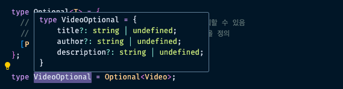

## 타입스크립트의 막강한 타입

TypeScript에는 Conditional Types, Mapped Types, Utility Types 등의 타입 시스템을 지원한다.

### Type Alias와 Interface 뭘 써야 할까? (기술적인 측면)

이번에는 Type Alias와 interface의 차이점에 대해 알아보자

위 두 개는 성격과 그 특징이 모두 다름. 정확하게 어떻게 다른지 사용 방법에 대해 알고 시작하는 것이 좋다.

```tsx
type PositionType = {
  x: number;
  y: number;
};

interface PositionInterface {
  x: number;
  y: number;
}
```

위 두가지 Type, Interface는 굉장히 동일한 것을 묘사하고 있다.
이는 아래와 같이 object에 적용시킬 수 있다.

```tsx
// object ★
const obj1: PositionType = {
  x: 1,
  y: 2
};
const obj2: PositionInterface = {
  x: 4,
  y: 5
};
```

그리고 class로도 구현할 수 있음

```tsx
// class ★
class Pos1 implements PositionType {
  x: number;
  y: number;
}
class Pos2 implements PositionInterface {
  x: number;
  y: number;
}
```

type, interface 둘 다 사용할 수 있음. 또한 타입의 확장(extends) 도 가능하다.

```tsx
// Type, interface의 확장 Extends
interface ZPositionInterface extends PositionInterface {
  z: number;
}
type ZPositionType = PositionType & { z: number };
```

둘 다 굉장히 비슷함. 초기에는 Type에 대한 확장이 불가능했으나 이제 가능해졌다.

그렇다면 어떤 차이점이 있을까? interface 만 결합이 가능하다는 차이점이 있다.

```tsx
interface PositionInterface {
  x: number;
  y: number;
}
// only interfaces can be merged.
interface PositionInterface {
  z: number;
}

// 인터페이스 타입 결합 - x, y, z 값이 모두 존재해야 함
const obj12: PositionInterface = {
  x: 4,
  y: 5,
  z: 1
};
```

위와 같이 동일한 interface를 선언하게 되면 타입이 자동 결합되어 사용할 수 있게 된다.

```tsx
// Type aliases can use computed properties
type Person = {
  name: string;
  age: number;
};
type Name = Person['name']; // string type
type NumberType = number; // type만 쓸 수 있는 특징
type Direction = 'left' | 'right'; // union type
```

Type Alias의 경우에는 그 속성 타입을 추출해서 사용할 수 있고(Name 타입 참고)
type을 명확히 지정해서 사용하거나, Union type으로 사용하는 것은 타입만이 가능함

위 특징을 제대로 이해하고 넘어가는 것이 중요하다.

### Type Alias와 Interface 뭘 써야 할까? (개념적 측면)

Type과 Interface의 정의를 한번 더 짚어보자

- Interface : 규격사항. 객체 간 의사소통 시 정해진 인터페이스를 토대로 서로 소통하도록 약속, 계약한 정보, 기능을 구현 시 해당 규격사항의 정보를 나열한 것

  ```tsx
  interface CoffeeMaker {
    coffeeBeans: number;
    makeCoffee: (shots: number) => Coffee;
  }

  class CoffeeMachine implements CoffeeMaker {
    coffeeBeans: number;
    makeCoffee(shots: number) {
      return {};
    }
  }
  ```

  - ex) 이 클래스는 이 인터페이스를 구현한다.

- Type : 데이터를 담을 때 그 데이터의 타입을 의미함

  ```tsx
  type Position = {
    x: number;
    y: number;
  };

  const pos: Position = { x: 0, y: 0 };
  printPosition(pos);
  ```

  - ex) 이 컴포넌트에 전달할 수 있는 Props 타입은 이 타입이다.

### Utility Types이란? \***\*✮ → ✩\*\***

TypeScript에서는 다른 일반적인 프로그래밍 언어에서는 찾을 수 없는 타입 변환이 가능하다.
일부분 타입으로 변형하거나, 다른 타입과 조인하는 방법으로 변형할 수 있음

### Index Type

모든 것의 첫 출발인 Index type에 대해 알아보자

```tsx
const obj = {
  name: 'vicky'
};
obj.name; // vicky
obj['name']; // vicky
```

일반 객체에서는 위와 같은 방법으로 값을 가져올 수 있다. property를 직접 호출하거나 인덱스로 찾아옴
type도 위와 같이 비슷하게 할 수 있다.

```tsx
type Animal = {
  name: string;
  age: number;
  gender: 'male' | 'female';
};

type Name = Animal['name']; // string
const text: Name = 'hello'; // Ok!
const num: Name = 12; // Error!

type Gender = Animal['gender']; // male | female
type Keys = keyof Animal; // name | age | gender
const key: Keys = 'gender'; // Ok

type Person = {
  name: string;
  gender: Animal['gender'];
};
const person: Person = {
  name: 'vicky',
  gender: 'female'
};
```

위처럼 인덱스 타입을 이용하면 타입의 키에 접근해서 그 키의 value의 타입을 다시 선언해서 사용할 수 있다.

### Mapped Type

필수적인 Mapped Type에 대해 알아본다.
Mapped Type은 기존의 타입을 이용하면서 다른 형태로 타입을 변환할 수 있다.

아래와 같은 타입이 있다고 하자.

```tsx
type Video = {
  title: string;
  author: string;
  description: string; // add
};

type VideoOptional = {
  title?: string;
  author?: string;
  description?: string; // add
};

type VideoReadOnly = {
  readonly title: string;
  readonly author: string;
  readonly description: string; // add
};
```

초기에는 title, author 타입만 지정되어 있던 3가지 타입에 description이 추가되었다면? Video, VideoOptional, VideoReadOnly 타입에 모두 적용해줘야 함

귀찮은 위의 방식을 Mapped Type으로 개선해볼 수 있다. 먼저 VidioOptional 타입을 먼저 바꿔보자

```tsx
type Optional<T> = {
  // 괄호 안에 넣으면 map과 같은 역할을 함 - key를 순회할 수 있음
  // P in keyof T: T가 가진 Key들을 순회하면서 타입을 정의
  [P in keyof T]?: T[P]; // for...in
};
```

위처럼 Key 자리에 괄호를 사용하면 map과 같은 역할로 key를 순회할 수 있게 되는데,
즉 [P in keyof T] 란 T의 키들을 순회하는 것을 의미함. 거기에 optional로 T[P]를 주면 각 키의 타입을 대입할 수 있는 것이므로 상단 VideoOptional 타입으로 선언한 것과 같은 타입을 만들 수 있음


```tsx
const videoOp: VideoOptional = {
  title: 'vicky video',
  types: 'video' // error!
};
```

위와 같이 videoOp이란 변수에 VideoOptional 타입을 지정해넣으면 위 타입이 그대로 반영됨.
types란 데이터는 VideoOptional 타입에 정의되지 않았으므로 타입 에러가 발생한다.

```tsx
type Optional<T> = {
  // 괄호 안에 넣으면 map과 같은 역할을 함 - key를 순회할 수 있음
  // P in keyof T: T가 가진 Key들을 순회하면서 타입을 정의
  [P in keyof T]?: T[P]; // for...in
};

type Animal = {
  name: string;
  age: number;
};

const animal: Optional<Animal> = {
  name: 'dog'
};
```

위와 같이 Animal의 mapped type으로 부분적 속성만 처리되도록 구현할 수 있음

VideoReadOnly도 마찬가지임

```tsx
type ReadOnly<T> = {
  readonly [P in keyof T]: T[P];
};
```

위와 같이 처리해서 VideoReadOnly 타입을 지정하면 아래와 같이 도출


```tsx
const video: VidioReadOnly = {
  title: 'hi',
  author: 'vicky',
  description: 'hello'
};
video.title = 'bye'; // error
```

위 코드에서 값을 직접 변경하는 것을 막도록 처리해줄 수 있다.

```tsx
type Nullable<T> = { [P in keyof T]: T[P] | null };
```

그럼 위 Nullable 타입은 무엇일까? 기존의 타입을 사용하거나 null 타입으로 처리할 수 있는 타입을 의미함

```tsx
const obj2: Nullable<Video> = {
  title: null,
  author: null,
  description: 'hello'
};
```

위와 같이 처리할 수도 있다는 것임!

```tsx
type Proxy<T> = {
  get(): T;
  set(value: T): void;
};
type Proxify<T> = { [P in keyof T]: Proxy<T[P]> };
```

위 Proxy, Proxify는 아래와 같이 활용해 볼 수 있음

```tsx
type ProxyWrapperFn = <T>(value: T) => Proxy<T>;

const wrappedProxy: ProxyWrapperFn = (value) => {
  let _value = value;
  return {
    get() {
      return _value;
    },
    set(value) {
      _value = value;
    }
  };
};

const videoProxy: Proxify<Video> = {
  title: wrappedProxy('영상제목'),
  author: wrappedProxy('작성자'),
  description: wrappedProxy('설명')
};

videoProxy.title.get(); // 영상제목
videoProxy.title.set('new title');
videoProxy.title.get(); // new title
videoProxy.description.set('new description');
videoProxy.description.get(); // new description
```

다시 보자. 이해가 빠삭해질 때까지 보자

### Conditional Type

Conditional Type은 조건부로 타입을 결정할 수 있는 타입을 의미함

```tsx
type Check<T> = T extends string ? boolean : number;
type Type1 = Check<string>; // boolean
type Type2 = Check<'aa'>; // boolean
type Type3 = Check<number>; // number
```

위를 활용해 아래와 같이 conditional type을 구성할 수도 있음

```tsx
// T extends U ? X : Y
type TypeName<T> = T extends string
  ? 'string'
  : T extends number
  ? 'number'
  : T extends boolean
  ? 'boolean'
  : T extends undefined
  ? 'undefined'
  : T extends Function
  ? 'function'
  : 'object';

type T0 = TypeName<string>; // 'string' type
type T1 = TypeName<'a'>; // 'string' type
type T2 = TypeName<() => void>; // 'function' type
```

위 내용으로 다양한 활용을 해볼 수 있음
