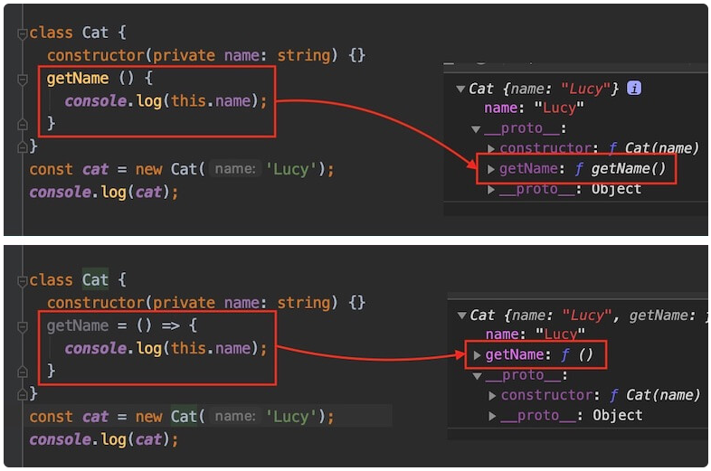

## 함수(Function)

### this

함수를 다루는데 있어 가장 중요한 내용 중 하나가 바로 this이다.  
함수 내 this는 전역 객체를 참조하거나(sloppy mode), undefined(strinct mode)가 되는 등 우리가 원하는 콘텍스트(context)를 잃고 다른 값이 되는 경우들이 있다.

```tsx
const obj = {
  a: 'Hello',
  b: function () {
    console.log(this.a); // obj.a
    // Inner function
    function b() {
      console.log(this.a); // global.a
    }
  },
};
```

특히 '호출하지 않는 메소드'를 사용하는 경우 `this`로 인한 문제가 발생한다.  
아래의 예제는 객체 데이터 `obj`에서 `b`메소드는 `a`속성을 `this`를 통해 참조하고 있다.

```tsx
const obj = {
  a: 'Hello!',
  b: function () {
    console.log(this.a); // Hello!
  },
};
```

위 객체를 기준으로 아래의 예제와 같이 '호출하지 않는 메소드'를 사용(할당)하는 경우,  
`this`가 유효한 콘텍스트를 잃어버리고 `a`를 참조할 수 없게 된다.

> 많은 경우 콜백 함수가 이에 해당한다.

```tsx
obj.b(); // Hello!
const b = obj.b;
b(); // Cannot read property 'a' of undefined

function someFn(cb: any) {
  cb();
}
someFn(obj.b); // Cannot read property 'a' of undefined
setTimeout(obj.b, 100); // undefined
```

이런 상황에서 this 콘텍스트가 정상적으로 유지되어 a 속성을 참조할 수 있는 방법에 대해 알아보자.

1. 첫 번째는 [bind 메소드](https://developer.mozilla.org/ko/docs/Web/JavaScript/Reference/Global_Objects/Function/bind)를 사용해 `this`를 **직접 연결**해주는 방법이다.

   > 타입스크림트에서 bind, call, apply 메소드는 기본적으로 인수 타입 체크를 하지 않기 때문에  
   > 컴파일러 옵션에서 `strict: true` (혹은 `strictBindCallApply: true`)로 지정해줘야 정상적으로 타입 체크를 한다.

   ```tsx
   const b = obj.b.bind(obj);
   b(); // Hello!

   function someFn(cb: any) {
     cb();
   }
   someFn(obj.b.bind(obj)); // Hello!
   setTimeout(obj.b.bind(obj), 100); // Hello!
   ```

2. 두 번째는 화살표 함수를 사용하여 유효한 콘텍스트를 유지하면서 메소드를 **호출**하는 방법이다.

   > 화살표 함수는 호출된 곳이 아닌 함수가 생성된 곳에서 `this`를 캡쳐한다.

   ```tsx
   const b = () => obj.b();
   b(); // Hello

   function someFn(cb: any) {
     cb();
   }
   someFn(() => obj.b()); // Hello
   setTimeout(() => obj.b(), 100); // Hello
   ```

   만약 클래스의 메소드 멤버를 정의하는 경우, 프로토타입(prototype) 메소드가 아닌 화살표 함수를 사용할 수 있다.

   ```tsx
   class Cat {
     constructor(private name: string) {}
     getName = () => {
       console.log(this.name);
     };
   }
   const cat = new Cat('Nana');
   cat.getName(); // Nana

   const getName = cat.getName;
   getName(); // Nana

   function someFn(cb: any) {
     cb();
   }
   someFn(cat.getName); // Nana
   ```

   여기에서 주의할 점은 인스턴스를 생성할 때마다 개별적인 getName이 만들어지게 되는데,  
   일반적인 메소드 호출에서의 화살표 함수 사용은 비효율적이지만 만약 메소드를 주로 콜백으로 사용하는 경우엔 프로토타입의 새로운 클로저 호출보다 화살표 함수로 생성된 `getName` 참조가 훨씬 효율적일 수 있다.

   > 각 방법은 메모리와 성능에 대한 trade-off이므로 상황에 맞게 선택하는 것이 좋다.

   

   [한눈에 보는 타입스크립트] 내 함수 - this 영역 설명 이미지 사용

### 명시적 this

아래의 예제를 살펴보면 `someFn` 함수 내 `this`가 캡처할 수 있는 `cat` 객체를 [call 메소드](https://developer.mozilla.org/ko/docs/Web/JavaScript/Reference/Global_Objects/Function/call)를 통해 전달 및 실행했으나 strict mode에서 `this`는 암식적인(implicitly) any 타입이므로 에러가 발생한다.

```tsx
interface ICat {
  name: string;
}
const cat: ICat = {
  name: 'Nana',
};

function someFn(greeting: string) {
  // Error - TS2683: 'this' implicitly has type 'any' because it does not have a type annotation.
  console.log(`${greeting} ${this.name}`);
}
someFn.call(cat, 'Hello'); // Hello Nana
```

위 경우 this의 타입을 명시적으로 선언할 수 있다. 다음과 같인 첫 번째 가짜(fake) 매개변수로 this를 선언한다.

```tsx
interface ICat {
  name: string;
}
const cat: ICat = {
  name: 'Nana',
};
function someFn(this: ICat, greeting: string) {
  console.log(`${greeting} ${this.name}`);
}
someFn.call(cat, 'Hello'); // Hello Nana
```
